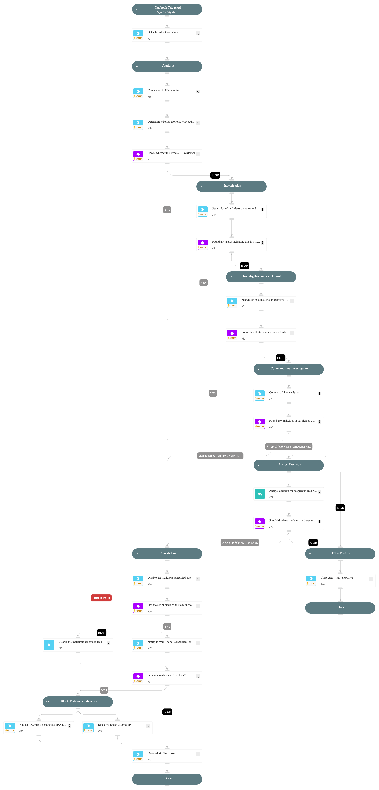

This playbook handles "Uncommon remote scheduled task created" alerts.

Playbook Stages:

Analysis:

- The playbook checks if the remote IP is external or has a bad reputation.

Investigation:
During the alert investigation, the playbook will perform the following:

- Searches for related XSIAM alerts on the endpoint that use the following MITRE techniques to identify malicious activity: T1202 - Indirect Command Execution, T1021 - Remote Services.
- Searches for related XSIAM agent alerts on the remote endpoint, to determine if the creation of the scheduled task is part of an attack pattern.
- Searches for suspicious command-line parameters indicating a malicious scheduled task.

Remediation:

- Automatically disable the malicious scheduled task.
- Block the malicious IP (requires analyst approval).
- Automatically Close the alert.

## Dependencies

This playbook uses the following sub-playbooks, integrations, and scripts.

### Sub-playbooks

This playbook does not use any sub-playbooks.

### Integrations

This playbook does not use any integrations.

### Scripts

* CommandLineAnalysis
* IsIPInRanges
* Print
* SearchIncidentsV2
* block-external-ip
* ip-enrichment

### Commands

* closeInvestigation
* core-add-indicator-rule
* core-execute-command
* core-get-cloud-original-alerts

## Playbook Inputs

---
There are no inputs for this playbook.

## Playbook Outputs

---
There are no outputs for this playbook.

## Playbook Image

---

