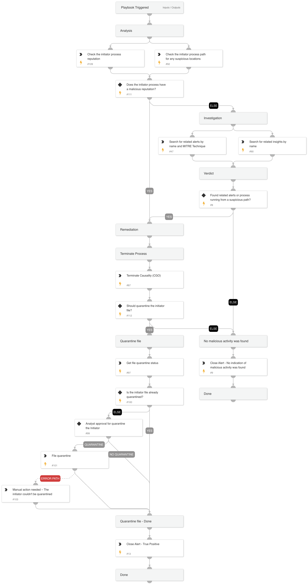

This playbook handles "Unusual process accessed web browser credentials using terminal" alerts.

Playbook Stages:

Analysis:
During the analysis, the playbook will perform the following:

- Checks the Initiator file path for any suspicious locations.
- Check the initiator process reputation.

The playbook determines the appropriate verdict based on the initiator file's reputation. If the file is malicious, it proceeds to remediation actions; otherwise, it continues to the investigation phase.

Investigation:
During the alert investigation, the playbook will perform the following:

- Searches for related XSIAM alerts and insights on the endpoint by specific alert names or by the following MITRE technique to identify malicious activity:  T1555.001 - Credentials from Password Stores: Keychain.

The playbook determines the appropriate verdict. If related alerts or insights are found, it proceeds to remediation actions; otherwise, it closes the alert with the message "No indication of malicious activity was found.

Remediation:

- Automatically terminate the causality process.
- Quarantine the Initiator file (requires analyst approval).
- Automatically Close the alert.

## Dependencies

This playbook uses the following sub-playbooks, integrations, and scripts.

### Sub-playbooks

This playbook does not use any sub-playbooks.

### Integrations

This playbook does not use any integrations.

### Scripts

* MatchRegexV2
* SearchAlertsV2

### Commands

* closeInvestigation
* core-get-quarantine-status
* core-quarantine-files
* core-terminate-causality
* file

## Playbook Inputs

---
There are no inputs for this playbook.

## Playbook Outputs

---
There are no outputs for this playbook.

## Playbook Image

---

