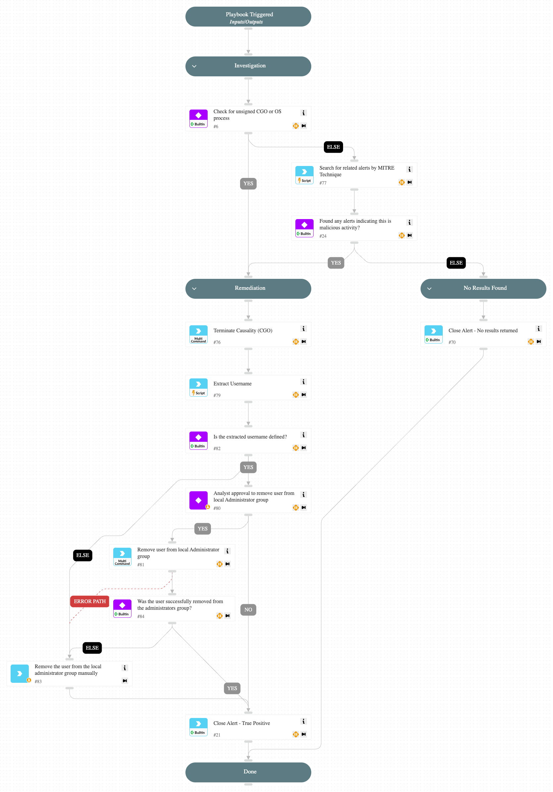

This playbook is designed to handle the alert
'User added to local administrator group using a PowerShell command'

The playbook executes the following stages:

Investigation:
Check the following parameters to determine if remediation actions are needed:
- Cortex XSIAM alerts related to the hostname by MITRE tactics indicating malicious activity.
- Whether the process is unsigned.

Remediation:
Handles malicious alerts by terminating the relevant processes and requesting the analyst's approval to remove the user from the local Administrators group.
Handles non-malicious alerts identified during the investigation.

## Dependencies

This playbook uses the following sub-playbooks, integrations, and scripts.

### Sub-playbooks

This playbook does not use any sub-playbooks.

### Integrations

CortexCoreIR

### Scripts

* SearchIncidentsV2
* Set

### Commands

* core-terminate-causality
* closeInvestigation
* core-run-script-execute-commands

## Playbook Inputs

---
There are no inputs for this playbook.

## Playbook Outputs

---
There are no outputs for this playbook.

## Playbook Image

---

