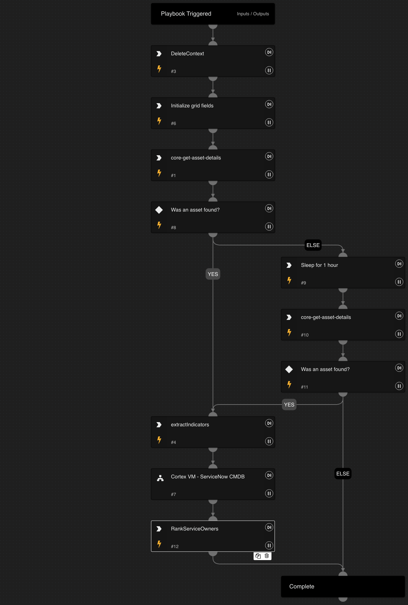

This playbook handles vulnerability issues by enriching assets to find potential remediation owners.

## Dependencies

This playbook uses the following sub-playbooks, integrations, and scripts.

### Sub-playbooks

* Cortex VM - ServiceNow CMDB

### Integrations

* Cortex Core - IR

### Scripts

* DeleteContext
* GridFieldSetup
* RankServiceOwners
* Set
* Sleep

### Commands

* core-get-asset-details
* extractIndicators
* setIssue

## Playbook Inputs

---
There are no inputs for this playbook.

## Playbook Outputs

---
There are no outputs for this playbook.

## Playbook Image

---

