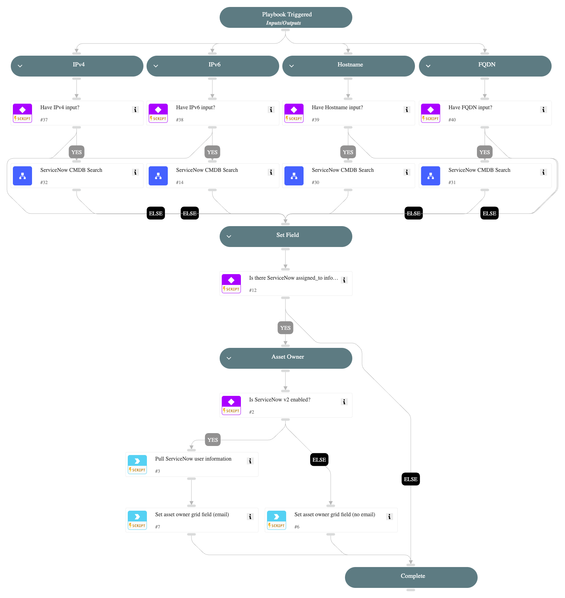
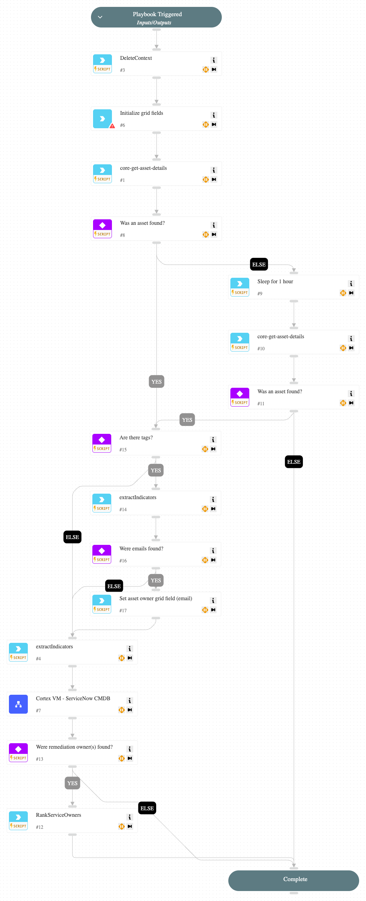

The **Cortex Vulnerability Management** pack is supported by the Vulnerability Management module of Cortex XSIAM.

[Cortex XSIAM](https://www.paloaltonetworks.com/cortex/cortex-xsiam) is a new approach to security operations that drives dramatically better security outcomes by closely integrating and automating the capabilities and processes of a modern security operations center (SOC). 

By leveraging the vulnerability detection capabilities present in many of the core and optional Cortex XSIAM add-ons, Cortex XSIAM is able to help organizations make sense of their vulnerability posture and take mitigating actions. 

This pack aims to further augment these platform capabilities by providing powerful automation content to aid in the enrichment and response of vulnerability issues, by providing playbooks and scripts to stitch together relevant investigation details such as the remediation owner and offer appropriate mitigation options to defenders.

## What does this pack do?

This pack contains all of the integrations, automations, and playbooks necessary to fully automate the investigation, remediation, verification, and reporting on ASM risks within Cortex Xpanse Expander and Cortex XSIAM. Currently our pack:

- Enriches services, assets, and alerts based on out-of-the-box integrations with sources like CMDBs, Cloud Service Providers, VM solutions, and more.

## What is included in this pack?

The main Cortex Vulnerability Management playbook is the `Cortex VM - Vulnerability Issue` playbook. This playbook contains a set of sub-playbooks, which support many different remediation ownership paths that can be taken depending on the types of configured integrations and issue source.

- Playbooks
  - [Cortex VM - ServiceNow CMDB](#cortex-vm---servicenow-cmdb)
  - [Cortex VM - Vulnerability Issue](#cortex-vm---vulnerability-issue)

### Playbooks

#### Cortex VM - ServiceNow CMDB

A playbook that when given provided indicators (IPs, Hostnames, FQDNs, etc.), enriches ServiceNow CMDB information relevant to vulnerability issues.

#### Cortex VM - Vulnerability Issue

A playbook that handles vulnerability issues by enriching assets to find potential asset owners.

