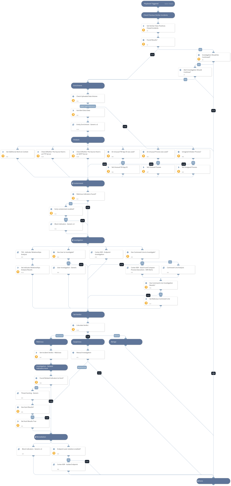

The playbook investigates Cortex XDR incidents involving large upload alerts. The playbook is designed to run as a sub-playbook of ‘Cortex XDR Alerts Handling v2’. 

The playbook consists of the following procedures:
- Searches for similar previous incidents that were closed as false positives.
- Enrichment and investigation of the initiator and destination hostname and IP address.
- Enrichment and investigation of the initiator user, process, file, or command if it exists.
- Detection of related indicators and analysis of the relationship between the detected indicators.
- Utilize the detected indicators to conduct threat hunting.
- Blocks detected malicious indicators.
- Endpoint isolation.

This playbook supports the following Cortex XDR alert names:
- Large Upload (Generic)
- Large Upload (SMTP)
- Large Upload (FTP)
- Large Upload (HTTPS)

## Dependencies

This playbook uses the following sub-playbooks, integrations, and scripts.

### Sub-playbooks

* Cortex XDR - Search and Compare Process Executions - XDR Alerts
* Cortex XDR - Endpoint Investigation
* User Investigation - Generic
* Block Indicators - Generic v3
* Cortex XDR - Isolate Endpoint
* Entity Enrichment - Generic v3
* TIM - Indicator Relationships Analysis
* Threat Hunting - Generic
* Command-Line Analysis

### Integrations

* CortexXDRIR

### Scripts

* SetAndHandleEmpty
* DBotFindSimilarIncidents
* Set

### Commands

* xdr-get-cloud-original-alerts
* setIncident

## Playbook Inputs

---

| **Name** | **Description** | **Default Value** | **Required** |
| --- | --- | --- | --- |
| InternalIPRanges | A list of IP ranges to check the IP against. The list should be provided in CIDR notation, separated by commas. An example of a list of ranges would be: "172.16.0.0/12,10.0.0.0/8,192.168.0.0/16" \(without quotes\). If a list is not provided, will use default list provided in the IsIPInRanges script \(the known IPv4 private address ranges\). | lists.PrivateIPs | Optional |
| FurtherInvestigation | Determines whether an incident should be further investigated if similar previous false positive incidents were found. Possible values:True/False. Default: False. | False | Required |
| AutoBlockIndicators | Determine whether the given indicators be automatically blocked, or if the user should be given the option to choose. Possible values:True/False. Default: True. If set to False - no prompt will appear, and all provided indicators will be blocked automatically. If set to True - the user will be prompted to select which indicators to block. | True | Required |
| BlockIndicators_UserVerification | Determine whether the blocking of any indicator requires the verification of the user. Possible values:True/False. Default: False. | False | Optional |
| EarlyContainment | Whether early containment should be allowed when the IP address is known to be malicious. Possible values:True/False. Default: True. | True | Required |
| AutoIsolateEndpoint | Whether to isolate the initiating endpoint automatically if the investigation verdict is malicious. Possible values:True/False. Default: False. | False | Required |
| Alert_ID | The Cortex XDR alert ID. | PaloAltoNetworksXDR.Incident.alerts.alert_id | Optional |
| Transferred_Data _Threshold | Specify the uploaded data threshold volume \(in MB\) from which large upload alerts should be investigated. By setting a threshold, you will be able to determine which large upload alerts require investigation. Default value: 150 \(MB\). | 150 | Required |
| FWApps_Processes_Whitlist | A list of known and authorized FW application IDs and processes used in the organization. | ip,tcp,udp,ssl,syslog,quic,Chrome.exe,Firefox.exe,Opera.exe,Safari.exe,iexplore.exe,msedge.exe,brave.exe | Optional |

## Playbook Outputs

---
There are no outputs for this playbook.

## Playbook Image

---

