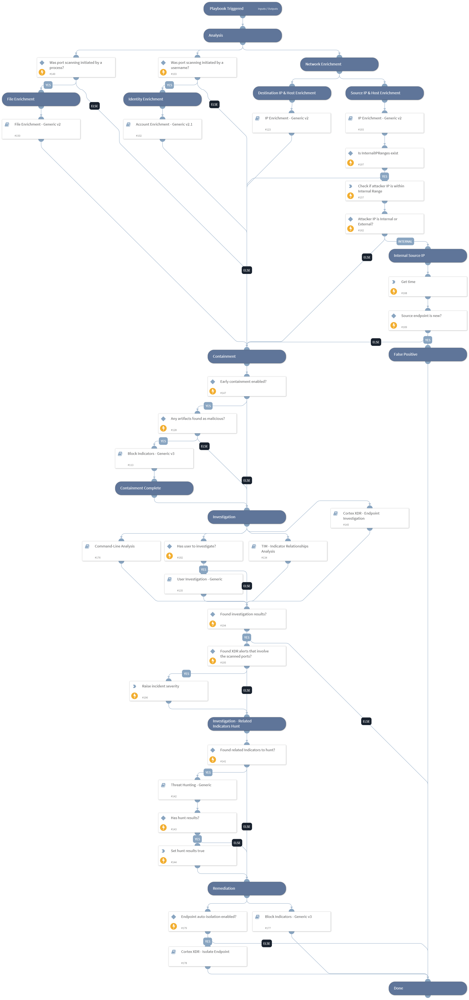

The playbook investigates Cortex XDR incidents involving port scan alerts. The playbook is designed to run as a sub-playbook of ‘Cortex XDR Alerts Handling’. 

The playbook consists of the following procedures:
- Enrichment and investigation of the scanner and scanned hostname and IP address.
- Enrichment and investigation of the initiator user, process, file, or command if it exists.
- Detection of related indicators and analysis of the relationship between the detected indicators.
- Utilize the detected indicators to conduct threat hunting.
- Blocks detected malicious indicators.
- Endpoint isolation.

This playbook supports the following Cortex XDR alert names:
- Suspicious port scan
- Port scan by suspicious process
- Highly suspicious port scan
- Port scan.

## Dependencies

This playbook uses the following sub-playbooks, integrations, and scripts.

### Sub-playbooks

* Cortex XDR - Endpoint Investigation
* Account Enrichment - Generic v2.1
* Cortex XDR - Isolate Endpoint
* TIM - Indicator Relationships Analysis
* User Investigation - Generic
* Command-Line Analysis
* Block Indicators - Generic v3
* File Enrichment - Generic v2
* IP Enrichment - Generic v2
* Threat Hunting - Generic

### Integrations

This playbook does not use any integrations.

### Scripts

* IsIPInRanges
* GetTime
* Set

### Commands

* setIncident

## Playbook Inputs

---

| **Name** | **Description** | **Default Value** | **Required** |
| --- | --- | --- | --- |
| InternalIPRanges | A list of IP ranges to check the IP against. The comma-separated list should be provided in CIDR notation. For example, a list of ranges would be: "172.16.0.0/12,10.0.0.0/8,192.168.0.0/16" \(without quotes\). | lists.PrivateIPs | Optional |
| Username | The user name used for port scanning. | PaloAltoNetworksXDR.Incident.alerts.user_name | Optional |
| SrcIPAddress | The source IP address from which the port scanning was initiated. | PaloAltoNetworksXDR.Incident.alerts.action_local_ip | Optional |
| DstIPAddress | Scanned destination IP address. | PaloAltoNetworksXDR.Incident.alerts.action_remote_ip | Optional |
| DstPort | Scanned port numbers. | PaloAltoNetworksXDR.Incident.alerts.action_remote_port | Optional |
| EarlyContainment | Whether early containment should be allowed when the IP address is known to be malicious. Possible values:True/False. Default:True. | True | Required |
| SrcHostname | Source host name from which port scanning was initiated. | PaloAltoNetworksXDR.Incident.alerts.host_name | Optional |
| EndpointID | Source endpoint ID from which port scanning was initiated. | PaloAltoNetworksXDR.Incident.alerts.endpoint_id | Optional |
| Initiator_CMD | The command used to initiate port scan activity. | PaloAltoNetworksXDR.Incident.alerts.action_process_image_command_line | Optional |
| Initiator_Process_SHA256 | Process SHA256 file hash initiated port scanning. | PaloAltoNetworksXDR.Incident.alerts.action_process_image_sha256 | Optional |
| AutoIsolateEndpoint | Whether to automatically isolate endpoints. | False | Required |
| AutoBlockIndicators | Possible values: True/False.  Default: True. Should the given indicators be automatically blocked, or should the user be given the option to choose?  If set to False - no prompt will appear, and all provided indicators will be blocked automatically. If set to True - the user will be prompted to select which indicators to block. | True | Optional |

## Playbook Outputs

---

| **Path** | **Description** | **Type** |
| --- | --- | --- |
| PortScan.BlockPorts | Indicates whether there's a need to block the ports used for exploitation on the scanned host. | unknown |
| PortScan.AttackerIPs | Attacker IPs from the port scan alert. | unknown |
| PortScan.AttackerHostnames | Attacker hostnames from the port scan alert. | unknown |
| PortScan.AttackerUsername | Attacker username from the port scan alert. | unknown |
| PortScan.FileArtifacts | File artifacts from the port scan alert. | unknown |
| PortScan.LateralMovementFirstDatetime | Lateral Movement First Date time from the port scan alert. | unknown |
| PortScan.PortScanFirstDatetime | Port Scan First Date time. | unknown |

## Playbook Image

---

