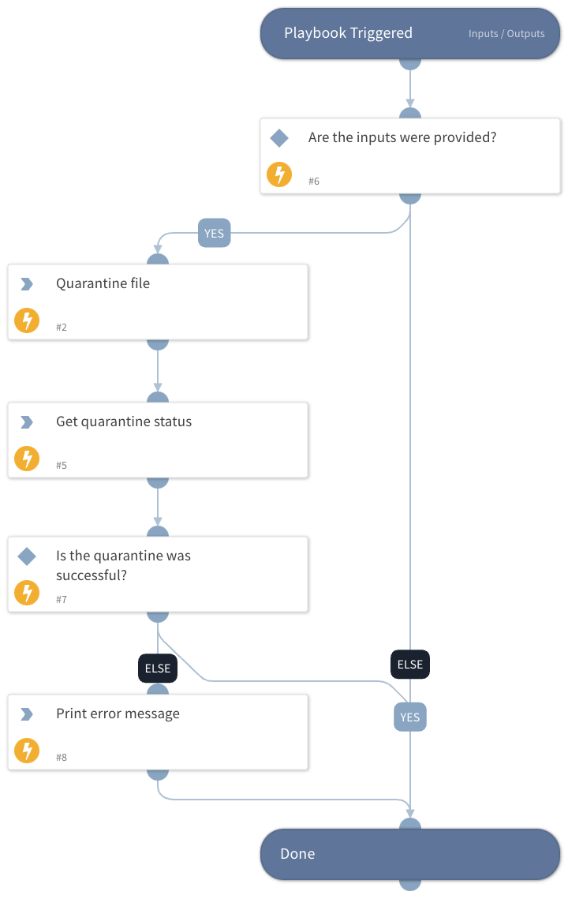

This playbook accepts "file path", "file hash" and "endpoint id" to quarantine a selected file and wait until the action is done. All 3 inputs are required to quarantine a single file. This playbook does not support the quarantine of multiple files.  

## Dependencies

This playbook uses the following sub-playbooks, integrations, and scripts.

### Sub-playbooks

This playbook does not use any sub-playbooks.

### Integrations

CortexXDRIR

### Scripts

PrintErrorEntry

### Commands

* xdr-get-quarantine-status
* xdr-file-quarantine

## Playbook Inputs

---

| **Name** | **Description** | **Default Value** | **Required** |
| --- | --- | --- | --- |
| file_hash | The file’s hash. Must be a valid SHA256 hash. |  | Required |
| file_path | The path for the selected file. |  | Required |
| endpoint_id | The file's location in the system. |  | Required |

## Playbook Outputs

---

| **Path** | **Description** | **Type** |
| --- | --- | --- |
| PaloAltoNetworksXDR.quarantineFiles.status.status | The status of the quarantine. | unknown |
| PaloAltoNetworksXDR.quarantineFiles.actionIds.endpointIdList.fileHash | The file hash SHA256. | unknown |
| PaloAltoNetworksXDR.quarantineFiles.actionIds.endpointIdList.filePath | The path of the file. | unknown |
| PaloAltoNetworksXDR.quarantineFiles.actionIds.actionId | The action id. | unknown |

## Playbook Image

---

