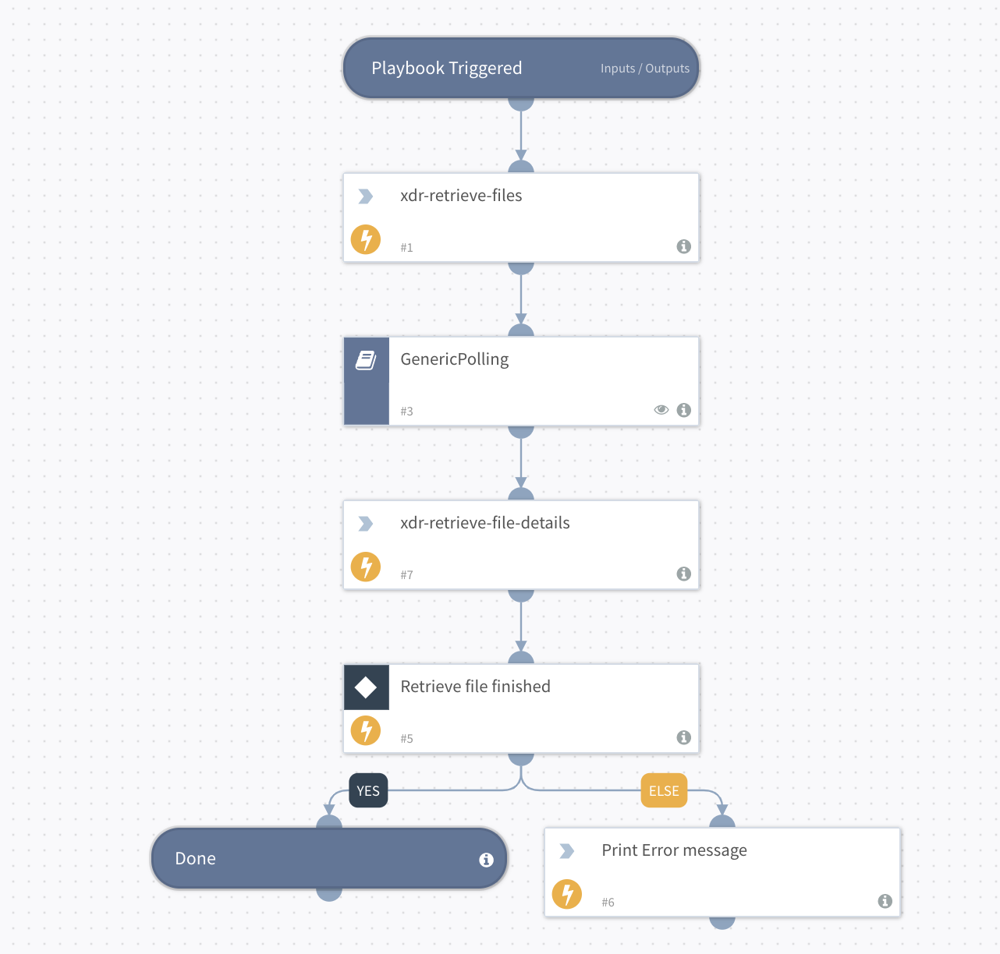

Deprecated. Use Cortex XDR - Retrieve File Playbook v2 instead.

## Dependencies

This playbook uses the following sub-playbooks, integrations, and scripts.

### Sub-playbooks

GenericPolling

### Integrations

CortexXDRIR

### Scripts

PrintErrorEntry

### Commands

* xdr-retrieve-file-details
* xdr-file-retrieve

## Playbook Inputs

---

| **Name** | **Description** | **Default Value** | **Required** |
| --- | --- | --- | --- |
| endpoint_ids | A comma-separated list of endpoint IDs. |  | Required |
| file_path | A comma-separated list of file paths in any platform. It can be used instead of the macOS/Windows/Linux file paths.  The order of the files path list must be parallel to the endpoints list order. Therefore, the first file path in the list is related to the first endpoint ID and so on. |  | Optional |
| windows_file_paths | A comma-separated list of Windows paths. Enter at least one path for either Windows, Linux, or Mac. |  | Optional |
| linux_file_paths | A comma-separated list Linux paths. Enter at least one path for either Windows, Linux, or Mac. |  | Optional |
| mac_file_paths | A comma-separated list of Mac paths. Enter at least one path for either Windows, Linux, or Mac. |  | Optional |

## Playbook Outputs

---

| **Path** | **Description** | **Type** |
| --- | --- | --- |
| File | Retrieve the file details command results. | unknown |
| File.Name | The full file name \(including the file extension\). | String |
| File.EntryID | The ID for locating the file in the War Room. | String |
| File.Size | The size of the file in bytes. | Number |
| File.MD5 | The MD5 hash of the file. | String |
| File.SHA1 | The SHA1 hash of the file. | String |
| File.SHA256 | The SHA256 hash of the file. | String |
| File.SHA512 | The SHA512 hash of the file. | String |
| File.Extension | The file extension. For example, 'xls'. | String |
| File.Type | The file type, as determined by libmagic \(same as displayed in the file entries\). | String |

## Playbook Image

---

