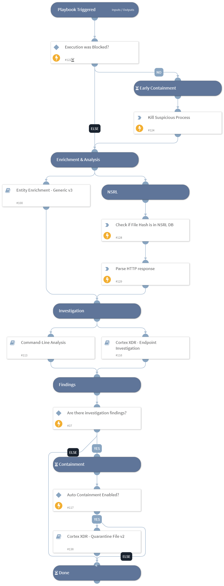

This playbook handles masquerading alerts based on the MITRE T1036 technique.
An attacker might leverage Microsoft Windows' well-known image names to run malicious processes without being caught.

**Attacker's Goals:**

An attacker attempts to masquerade as standard Windows images by using a trusted name to execute malicious code.

**Investigative Actions:**

Enrich and Investigate the executed process image and endpoint and verify if it is malicious using:

* File Reputation
* NSRL DB
* CommandLine Analysis
* Related Alerts

**Response Actions**

When the playbook executes, it checks for additional activity, and if a malicious behavior is found, the playbook proceeds with containment actions:

* Auto Process termination
* Auto file quarantine
* Manual containment

External resources:

[MITRE Technique T1036](https://attack.mitre.org/techniques/T1036/)

[Possible Microsoft process masquerading](https://docs-cortex.paloaltonetworks.com/r/Cortex-XDR-Analytics-Alert-Reference/Possible-Microsoft-process-masquerading).

## Dependencies

This playbook uses the following sub-playbooks, integrations, and scripts.

### Sub-playbooks

* Entity Enrichment - Generic v3
* Command-Line Analysis
* Cortex XDR - Endpoint Investigation

### Integrations

* CortexXDRIR

### Scripts

* ParseJSON
* HttpV2

### Commands

* xdr-snippet-code-script-execute

## Playbook Inputs

---

| **Name** | **Description** | **Default Value** | **Required** |
| --- | --- | --- | --- |
| AutoContainment | Setting this input to True will quarantine the file automatically in case of a malicious file. | False | Optional |
| FileSHA256 | The file SHA256 to investigate. | PaloAltoNetworksXDR.Incident.alerts.actor_process_image_sha256 | Optional |
| EndpointID | The IP, hostname, or ID of the endpoint. | PaloAltoNetworksXDR.Incident.alerts.endpoint_id | Optional |
| AlertID | The ID of the alert. | PaloAltoNetworksXDR.Incident.alerts.alert_id | Optional |

## Playbook Outputs

---
There are no outputs for this playbook.

## Playbook Image

---

