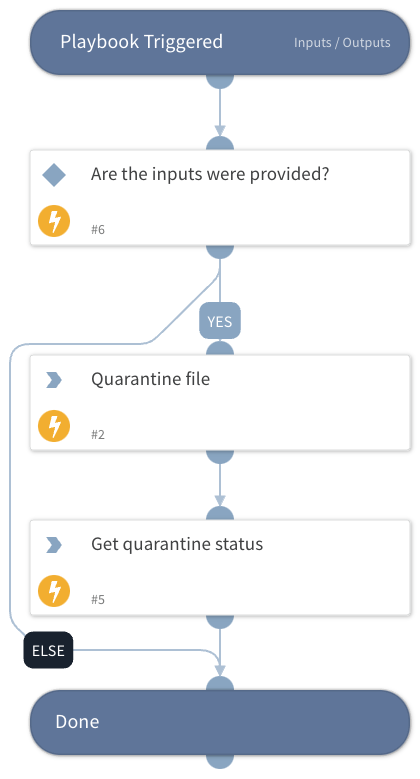

This playbook accepts file path, file hash and endpoint id in order to quarantine a selected file and wait until the action is done.

## Dependencies

This playbook uses the following sub-playbooks, integrations, and scripts.

### Sub-playbooks

This playbook does not use any sub-playbooks.

### Integrations

* CortexXDRIR

### Scripts

This playbook does not use any scripts.

### Commands

* xdr-get-quarantine-status
* xdr-file-quarantine

## Playbook Inputs

---

| **Name** | **Description** | **Default Value** | **Required** |
| --- | --- | --- | --- |
| file_hash | The file’s hash. Must be a valid SHA256 hash. |  | Required |
| file_path | The path for the selected file. |  | Required |
| endpoint_id | The file's location in the system. |  | Required |

## Playbook Outputs

---
There are no outputs for this playbook.

## Playbook Image

---

