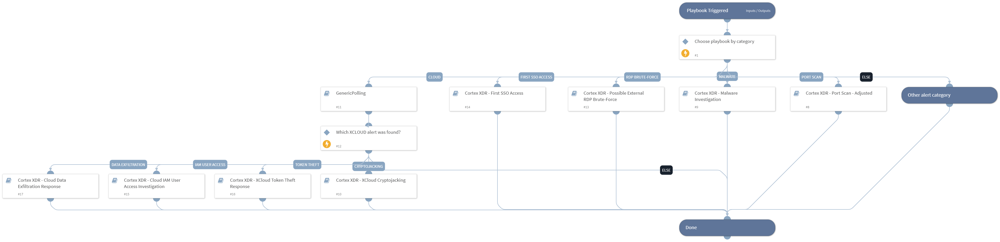

This playbook is used to loop over every alert in a Cortex XDR incident. 
Supported alert categories:
- Malware
- Port Scan
- Cloud Cryptojacking
- Cloud Token Theft
- RDP Brute-Force
- First SSO Access
- Cloud IAM User Access Investigation
- Identity Analytics
- Malicious Pod.

## Dependencies

This playbook uses the following sub-playbooks, integrations, and scripts.

### Sub-playbooks

* Cortex XDR - Large Upload
* Cortex XDR - Port Scan - Adjusted
* Cortex XDR - First SSO Access
* Cortex XDR - Cloud IAM User Access Investigation
* Cortex XDR - Identity Analytics
* Cortex XDR - XCloud Token Theft Response
* Cortex XDR - Cloud Data Exfiltration Response
* Cortex XDR - Malicious Pod Response - Agent
* Cortex XDR - Possible External RDP Brute-Force
* Cortex XDR - XCloud Cryptojacking
* Cortex XDR - Malware Investigation
* Cortex XDR Remote PsExec with LOLBIN command execution alert
* GenericPolling

### Integrations

This playbook does not use any integrations.

### Scripts

* Set

### Commands

This playbook does not use any commands.

## Playbook Inputs

---

| **Name** | **Description** | **Default Value** | **Required** |
| --- | --- | --- | --- |
| incident_id | Incident ID. | PaloAltoNetworksXDR.Incident.incident_id | Optional |
| alert_id | Alert ID. | PaloAltoNetworksXDR.Incident.alerts.alert_id | Optional |
| InternalIPRanges | A list of IP ranges to check the IP against. The list should be provided in CIDR notation, separated by commas. An example of a list of ranges would be: "172.16.0.0/12,10.0.0.0/8,192.168.0.0/16" \(without quotes\). If a list is not provided, will use default list provided in the IsIPInRanges script \(the known IPv4 private address ranges\). | lists.PrivateIPs | Optional |

## Playbook Outputs

---
There are no outputs for this playbook.

## Playbook Image

---

