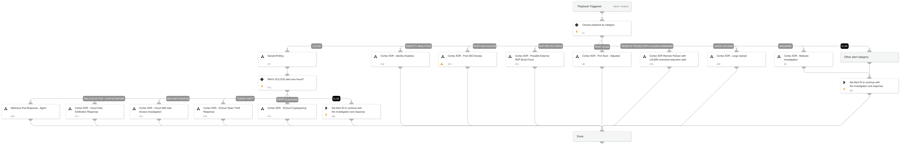

This playbook is used to loop over every alert in a Cortex XDR incident. 
Supported alert categories:
- Malware
- Port Scan
- Cloud Cryptojacking
- Cloud Token Theft
- RDP Brute-Force
- First SSO Access
- Cloud IAM User Access Investigation.

## Dependencies

This playbook uses the following sub-playbooks, integrations, and scripts.

### Sub-playbooks

* Cortex XDR - Malware Investigation
* Cortex XDR - XCloud Token Theft Response
* Cortex XDR - Possible External RDP Brute-Force
* GenericPolling
* Cortex XDR - XCloud Cryptojacking
* Cortex XDR - Cloud Data Exfiltration Response
* Cortex XDR - Cloud IAM User Access Investigation
* Cortex XDR - Port Scan - Adjusted
* Cortex XDR - First SSO Access

### Integrations

This playbook does not use any integrations.

### Scripts

This playbook does not use any scripts.

### Commands

This playbook does not use any commands.

## Playbook Inputs

---

| **Name** | **Description** | **Default Value** | **Required** |
| --- | --- | --- | --- |
| incident_id | Incident ID. | PaloAltoNetworksXDR.Incident.incident_id | Optional |
| alert_id | Alert ID. | PaloAltoNetworksXDR.Incident.alerts.alert_id | Optional |

## Playbook Outputs

---
There are no outputs for this playbook.

## Playbook Image

---

