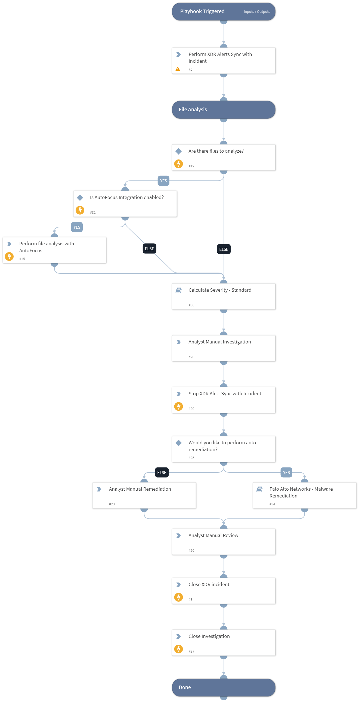

Deprecated. Use `Cortex XDR incident handling v3` instead. This playbook is triggered by fetching a Palo Alto Networks Cortex XDR incident. 
The playbook syncs and updates new XDR alerts that construct the incident. It enriches indicators using Threat Intelligence integrations and Palo Alto Networks AutoFocus. The incident's severity is then updated based on the indicators reputation and an analyst is assigned for manual investigation. If chosen, automated remediation with Palo Alto Networks FireWall is initiated. After a manual review by the SOC analyst, the XDR incident is closed automatically.

*** Note - The XDRSyncScript used by this playbook sets data in the XDR incident fields that were released to content from the Demisto server version 5.0.0.
For Demisto versions under 5.0.0, please follow the 'Palo Alto Networks Cortex XDR' documentation to upload the new fields manually.

## Dependencies

This playbook uses the following sub-playbooks, integrations, and scripts.

### Sub-playbooks

* Palo Alto Networks - Malware Remediation
* Calculate Severity - Standard

### Integrations

* CortexXDRIR

### Scripts

* XDRSyncScript
* StopScheduledTask

### Commands

* closeInvestigation
* autofocus-sample-analysis
* xdr-update-incident

## Playbook Inputs

---
There are no inputs for this playbook.

## Playbook Outputs

---
There are no outputs for this playbook.

## Playbook Image

---

