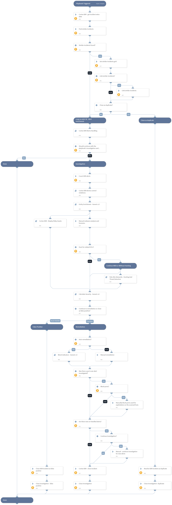

This playbook is triggered by fetching a Palo Alto Networks Cortex XDR incident.
The playbook syncs and updates new XDR alerts that construct the incident and triggers a sub-playbook to handle each alert by type.
Then, the playbook performs enrichment on the incident’s indicators and hunts for related IOCs.
Based on the severity, it lets the analyst decide whether to continue to the remediation stage or close the investigation as a false positive.
After the remediation, if there are no new alerts, the playbook stops the alert sync and closes the XDR incident and investigation. For performing the bidirectional sync, the playbook uses the incoming and outgoing mirroring feature added in XSOAR version 6.0.0. After the Calculate Severity - Generic v2 sub-playbook’s run, Cortex XSOAR will be treated as the single source of truth for the severity field, and it will sync only from Cortex XSOAR to XDR, so manual changes for the severity field in XDR will not update in the XSOAR incident.

## Dependencies

This playbook uses the following sub-playbooks, integrations, and scripts.

### Sub-playbooks

* Entity Enrichment - Generic v3
* Block Indicators - Generic v3
* Cortex XDR device control violations
* Cortex XDR Alerts Handling
* Palo Alto Networks - Hunting And Threat Detection
* Calculate Severity - Generic v2

### Integrations

* CortexXDRIR
* Cortex XDR - IR

### Scripts

* Set
* SetGridField
* DBotFindSimilarIncidents

### Commands

* xdr-update-incident
* closeInvestigation
* xdr-get-incident-extra-data
* linkIncidents

## Playbook Inputs

---

| **Name** | **Description** | **Default Value** | **Required** |
| --- | --- | --- | --- |
| incident_id | Incident ID. | incident.xdrincidentid | Optional |
| LinkSimilarIncidents | This input indicates whether the playbook will link similar incidents. To link similar incidents, specify Yes/No. | Yes | Optional |
| Hunting | This input indicates whether the playbook will hunt for related IOCs. Specify Yes/No. | Yes | Optional |
| InternalRange | A comma-separated list of internal IP ranges to check IP addresses against. The list should be provided in CIDR notation. An example of a list  "172.16.0.0/12,10.0.0.0/8,192.168.0.0/16" \(without quotes\).  If a list is not provided, will use the default list provided in the IsIPInRanges. |  | Optional |
| CriticalUsernames | A comma-separated list of names of critical users in the organization. This will affect the calculated severity of the incident. | admin,administrator | Optional |
| CriticalHostnames | A comma-separated list of names of critical endpoints in the organization. This will affect the calculated severity of the incident. |  | Optional |
| CriticalADGroups | A comma-separated list of DN names of critical Active Directory groups. This will affect the severity calculated for this incident. |  | Optional |
| InternalHostRegex | This is provided for the IsInternalHostName script that checks if the detected host names are internal or external if the hosts match the organization's naming convention. For example, the host testpc1 will have the following regex \\w\{6\}\\d\{1\}. |  | Optional |
| InternalDomainName | The organizations internal domain name. This is provided for the IsInternalHostName script that checks if the detected host names are internal or external if the hosts contain the internal domains suffix. For example, paloaltonetworks.com. If there is more than one domain, use the \| character to separate values such as \(paloaltonetworks.com\|test.com\). |  | Optional |
| TimeStamp | Timestamp in relative date format for query device control events from Cortex XDR. | 10 days | Optional |
| AutoRemediation | Whether remediation will be run automatically or manually. If set to "True" - remediation will be automatic. | False | Optional |
| XDRDomain | XDR instance domain | incident.xdrurl | Optional |
| AutoBlockIndicators | Possible values: True/False.  Default: True. Should the given indicators be automatically blocked, or should the user be given the option to choose?  If set to False - no prompt will appear, and all provided indicators will be blocked automatically. If set to True - the user will be prompted to select which indicators to block. | True | Optional |
| UserVerification | Possible values: True/False. Whether to provide user verification for blocking IPs.   False - No prompt will be displayed to the user. True - The server will ask the user for blocking verification and will display the blocking list. | False | Optional |

## Playbook Outputs

---
There are no outputs for this playbook.

## Playbook Image

---

