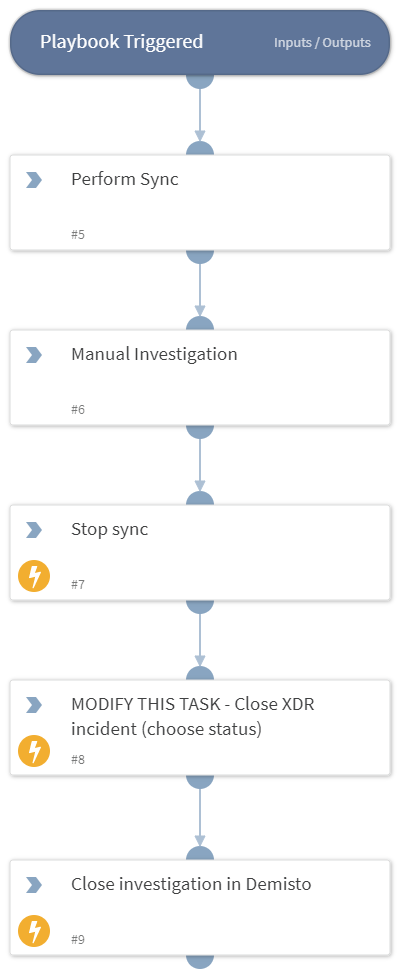

Deprecated. No available replacement. The playbook has been deprecated because the "xdr sync script" is no longer necessary due to the availability of the mirroring feature. This mirroring feature offers improved performance and we strongly recommended using this feature instead. 

Note: This playbook no longer works after migrating from the on prem instance of Cortex XSOAR to the Cortex XSOAR cloud hosted version.

Compares incidents in Palo Alto Networks Cortex XDR and Cortex XSOAR, and updates the incidents appropriately. When an incident is updated in Cortex XSOAR, the XDRSyncScript will update the incident in XDR. When an incident is updated in XDR, the XDRSyncScript will update the incident fields in Cortex XSOAR and rerun the current playbook. Do not use this playbook when enabling the incident mirroring feature added in XSOAR version 6.0.0.

## Dependencies

This playbook uses the following sub-playbooks, integrations, and scripts.

### Sub-playbooks

This playbook does not use any sub-playbooks.

### Integrations

* CortexXDRIR

### Scripts

* StopScheduledTask
* XDRSyncScript

### Commands

* xdr-update-incident
* closeInvestigation

## Playbook Inputs

---
There are no inputs for this playbook.

## Playbook Outputs

---
There are no outputs for this playbook.

## Playbook Image

---

