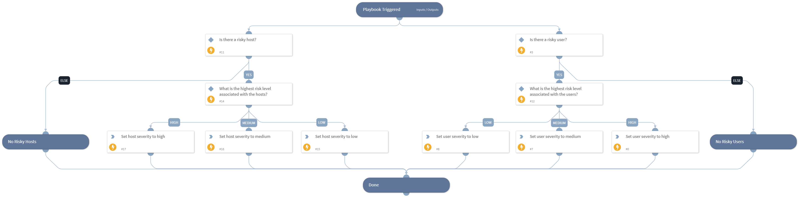

Calculates a severity for the incident based on the involvement of risky users or risky hosts in the incident, as determined by the Cortex XDR ITDR module.

## Dependencies

This playbook uses the following sub-playbooks, integrations, and scripts.

### Sub-playbooks

This playbook does not use any sub-playbooks.

### Integrations

This playbook does not use any integrations.

### Scripts

Set

### Commands

This playbook does not use any commands.

## Playbook Inputs

---

| **Name** | **Description** | **Default Value** | **Required** |
| --- | --- | --- | --- |
| XDRRiskyUsers | An object of risky users and their corresponding scores, as outputted by the "xdr-list-risky-users" command. | PaloAltoNetworksXDR.RiskyUser | Optional |
| XDRRiskyHosts | An object of risky hosts and their corresponding scores, as outputted by the "xdr-list-risky-hosts" command. | PaloAltoNetworksXDR.RiskyHost | Optional |

## Playbook Outputs

---

| **Path** | **Description** | **Type** |
| --- | --- | --- |
| Severities.XDRUserSeverity | The severity evaluated by the highest risk level associated with the Cortex XDR user. Can be Low, Medium or High. | unknown |
| Severities.XDRHostSeverity | The severity evaluated by the highest risk level associated with the Cortex XDR host. Can be Low, Medium or High. | unknown |

## Playbook Image

---

