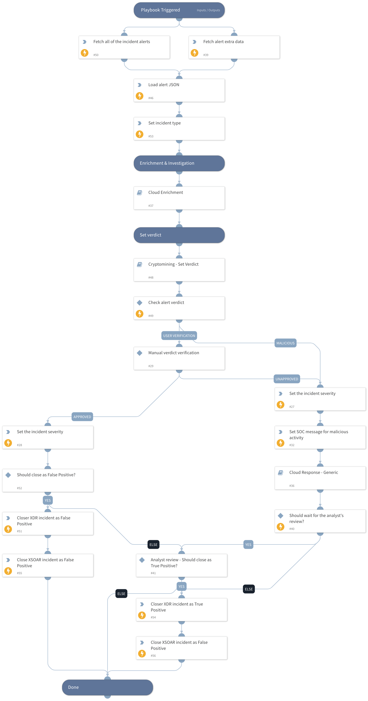

Investigates a Cortex XDR incident containing Cloud Cryptomining related alert. 
The playbook supports AWS, Azure, and GCP and executes the following:

- Cloud enrichment:
   - Collects info about the involved resources
   - Collects info about the involved identities
   - Collects info about the involved IPs
- Verdict decision tree
- Verdict handling:
   - Handle False Positives
   - Handle True Positives
      - Cloud Response - Generic sub-playbook.
- Notifies the SOC if a malicious verdict was found

## Dependencies
This playbook uses the following sub-playbooks, integrations, and scripts.

### Sub-playbooks
* Cloud Response - Generic
* Cloud Enrichment
* Cryptomining - Set Verdict

### Integrations
* CortexXDRIR

### Scripts
* LoadJSON
* IncreaseIncidentSeverity

### Commands
* closeInvestigation
* setIncident
* send-mail
* xdr-update-incident
* xdr-get-cloud-original-alerts
* xdr-get-incident-extra-data

## Playbook Inputs
---

| **Name** | **Description** | **Default Value** | **Required** |
| --- | --- | --- | --- |
| incident_id | The incident ID. |  | Optional |
| alert_id | The alert ID. |  | Optional |
| SOCEmailAddress | The SOC email address to use for the alert status notification. |  | Optional |
| requireAnalystReview | Whether to require an analyst review after the alert remediation. | True | Optional |

## Playbook Outputs
---
There are no outputs for this playbook.

## Playbook Image
---
