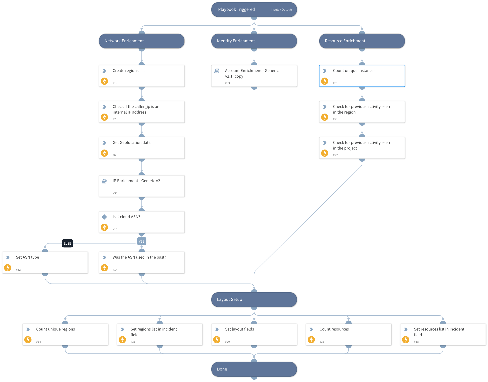

This playbook is responsible for collecting data from Cortex XDR detector and enriching data for further usage and building the layout.

The playbook collects or enriches the following data:
- Resource enrichment
   - Previous activity seen in the specified region or project
- Account enrichment
- Network enrichment
   - Attacker IP
   - Geolocation
   - ASN

## Dependencies
This playbook uses the following sub-playbooks, integrations, and scripts.

### Sub-playbooks
* IP Enrichment - Generic v2
* Account Enrichment - Generic v2.1

### Integrations
* Whois

### Scripts
* CopyContextToField
* If-Then-Else
* IsInCidrRanges
* Set

### Commands
* setIncident
* ip

## Playbook Inputs
---

| **Name** | **Description** | **Default Value** | **Required** |
| --- | --- | --- | --- |
| ResolveIP | Determines whether to convert the IP address to a hostname using a DNS query \(True/ False\). | True | Optional |
| InternalRange | A list of internal IP ranges to check IP addresses against.  For IP Enrichment - Generic v2 playbook. |  | Optional |

## Playbook Outputs
---
There are no outputs for this playbook.

## Playbook Image
---
