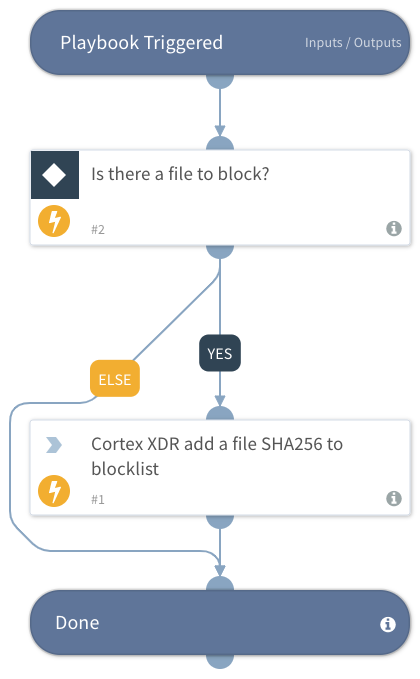

Use this playbook to add files to Cortex XDR block list with a given file SHA256 playbook input.

## Dependencies
This playbook uses the following sub-playbooks, integrations, and scripts.

### Sub-playbooks
This playbook does not use any sub-playbooks.

### Integrations
* CortexXDRIR

### Scripts
This playbook does not use any scripts.

### Commands
* xdr-blacklist-files

## Playbook Inputs
---

| **Name** | **Description** | **Default Value** | **Required** |
| --- | --- | --- | --- |
| HashList | List of hashed files you want to add to block list. Must be a valid SHA256 hash. |  | Optional |

## Playbook Outputs
---
There are no outputs for this playbook.

## Playbook Image
---
