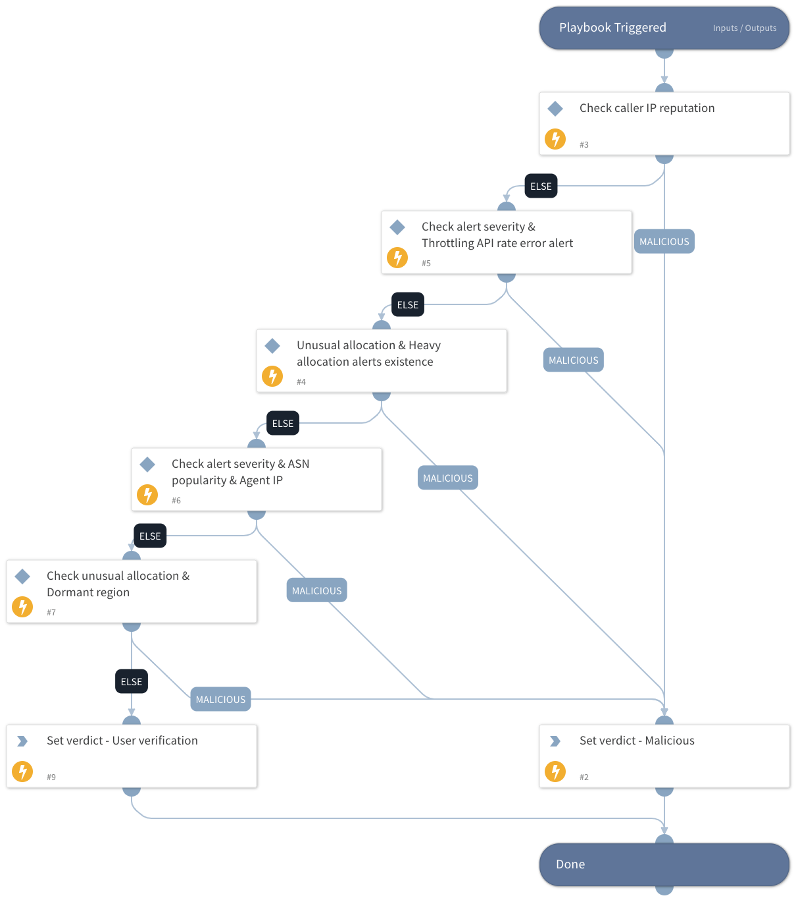

This playbook sets the alert's verdict as malicious if one of the following conditions is true:
- If the source IP address is malicious
- If the incident includes both "Unusual allocation of multiple cloud compute resources" AND "Cloud identity reached a throttling API rate" (medium/high severity)
- If the incident includes both "Unusual allocation of multiple cloud compute resources" AND "Suspicious heavy allocation of compute resources - possible mining activity" 
- If the incident includes "Unusual allocation of multiple cloud compute resources" with medium/high severity, the source ASN isn't known, and the source IP isn't known as well.
- If the incident includes both "Unusual allocation of multiple cloud compute resources" AND "A cloud compute instance was created in a dormant region"

If none of the conditions is true, the playbook will wait for an analyst's decision.

## Dependencies
This playbook uses the following sub-playbooks, integrations, and scripts.

### Sub-playbooks
This playbook does not use any sub-playbooks.

### Integrations
This playbook does not use any integrations.

### Scripts
Set

### Commands
This playbook does not use any commands.

## Playbook Inputs
---
There are no inputs for this playbook.

## Playbook Outputs
---

| **Path** | **Description** | **Type** |
| --- | --- | --- |
| alertVerdict | The alert verdict. | string |

## Playbook Image
---

