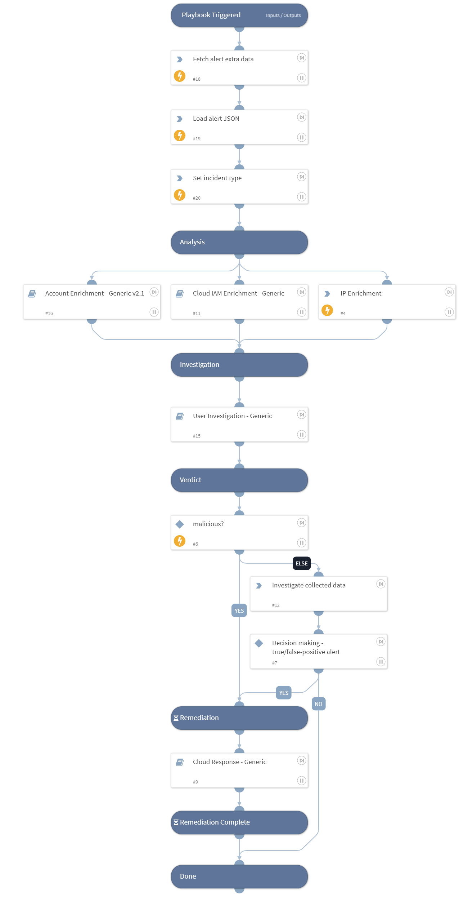

Investigate and respond to Cortex XDR Cloud alerts where a Cloud IAM user`s access key is used suspiciously to access the cloud environment. 
The following alerts are supported for AWS, Azure, and GCP environments.
- Penetration testing tool attempt
- Penetration testing tool activity
- Suspicious API call from a Tor exit node

## Dependencies

This playbook uses the following sub-playbooks, integrations, and scripts.

### Sub-playbooks

* Account Enrichment - Generic v2.1
* Cloud Response - Generic
* User Investigation - Generic
* Cloud IAM Enrichment - Generic

### Integrations

* CortexXDRIR
* XDR_iocs
* XQLQueryingEngine

### Scripts

LoadJSON

### Commands

* ip
* xdr-get-cloud-original-alerts
* setIncident

## Playbook Inputs

---

| **Name** | **Description** | **Default Value** | **Required** |
| --- | --- | --- | --- |
| AlertName | Alert name. |  | Optional |
| username | User name. |  | Optional |
| GCPProjectName | The GCP project name. |  | Optional |
| IPAddress | IP address from the XDR alert. |  | Optional |
| cloudProvider | The cloud service provider involved. |  | Optional |
| autoResourceRemediation | Whether to execute the resource remediation flow automatically. | False | Optional |
| AWS-resourceRemediationType | Choose the remediation type for the instances created.  AWS available types: Stop - for stopping the instances. Terminate - for terminating the instances. | Stop | Optional |
| Azure-resourceRemediationType | Choose the remediation type for the instances created.  Azure available types: Poweroff - for shutting down the instances. Delete - for deleting the instances. | Poweroff | Optional |
| GCP-resourceRemediationType | Choose the remediation type for the instances created.  GCP available types: Stop - For stopping the instances. Delete - For deleting the instances. | Stop | Optional |
| autoAccessKeyRemediation | Whether to execute the user remediation flow automatically. | False | Optional |
| AWS-accessKeyRemediationType | Choose the remediation type for the user's access key.  AWS available types: Disable - for disabling the user's access key. Delete - for deleting the user's access key. | Disable | Optional |
| GCP-accessKeyRemediationType | Choose the remediation type for the user's access key.  GCP available types: Disable - For disabling the user's access key. Delete - For deleting the user's access key. | Disable | Optional |
| autoUserRemediation | Whether to execute the user remediation flow automatically. | False | Optional |
| AWS-userRemediationType | Choose the remediation type for the user involved.  AWS available types: Delete - for deleting the user. Revoke - for revoking the user's credentials. | Revoke | Optional |
| Azure-userRemediationType | Choose the remediation type for the user involved.  Azure available types: Disable - for disabling the user. Delete - for deleting the user. | Disable | Optional |
| GCP-userRemediationType | Choose the remediation type for the user involved.  GCP available types: Delete - For deleting the user. Disable - For disabling the user. | Disable | Optional |
| autoBlockIndicators | Whether to block the indicators automatically. | False | Optional |
| alert_id | The alert ID. |  | Optional |
| cloudIdentityType | The cloud identity type. |  | Optional |
| SplunkIndex | Splunk's index name in which to search. Default is "\*" - All. | * | Optional |
| SplunkEarliestTime | The earliest time for the Splunk search query. | -1d | Optional |
| SplunkLatestTime | The latest time for the Splunk search query. | now | Optional |
| UserEmail | The user email to search Okta logs. |  | Optional |
| LoginCountry | The Country from which the user logged in. |  | Optional |
| SIEMFailedLogonSearch | Whether to search for failed logon logs from SIEM? Can be False or True. | True | Optional |
| ThreatLogSearch | Whether to search for threat logs from PAN-OS? Can be False or True. | True | Optional |
| XDRAlertSearch | Whether to search for related alerts from XDR? Can be False or True. | True | Optional |
| OktaSearch | Whether to search for logs from Okta? Can be False or True. | True | Optional |
| XDRUsernameField | Cortex XDR user name field. | identity_name | Optional |
| QRadarSearchTime | The search time for the QRadar search query. For example:  Last 1 days. | Last 1 days | Optional |
| AzureSearchTime | The Search Time for the Azure Log Analytics search query. for example: ago\(1d\) | ago(1d) | Optional |
| ASN | The ASN from which the user logged in. |  | Optional |

## Playbook Outputs

---
There are no outputs for this playbook.

## Playbook Image

---

