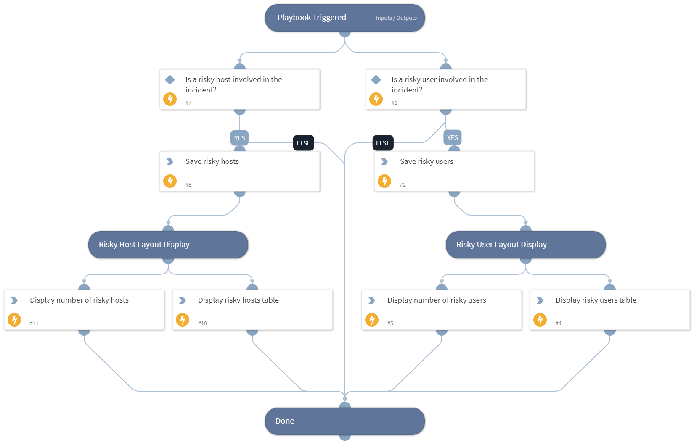

This playbooks displays risky users and risky hosts, as detected by Cortex XDR's ITDR module. The data is displayed in incident fields in XDR incidents.

## Dependencies

This playbook uses the following sub-playbooks, integrations, and scripts.

### Sub-playbooks

This playbook does not use any sub-playbooks.

### Integrations

This playbook does not use any integrations.

### Scripts

* SetAndHandleEmpty
* SetGridField

### Commands

setIncident

## Playbook Inputs

---

| **Name** | **Description** | **Default Value** | **Required** |
| --- | --- | --- | --- |
| XDRRiskyUsers | A list of risky usernames, their scores, risk levels, and the reasons for the risk, as outputted from the "xdr-list-risky-users" command. | PaloAltoNetworksXDR.RiskyUser | Optional |
| XDRRiskyHosts | A list of risky hosts, their scores, risk levels, and the reasons for the risk, as outputted from the "xdr-list-risky-hosts" command. | PaloAltoNetworksXDR.RiskyHost | Optional |

## Playbook Outputs

---
There are no outputs for this playbook.

## Playbook Image

---

