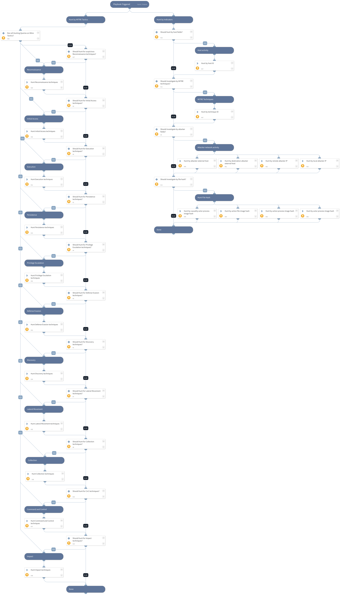

This playbook is part of the 'Malware Investigation And Response' pack. For more information, refer to https://xsoar.pan.dev/docs/reference/packs/malware-investigation-and-response. This playbook handles all the endpoint investigation actions available with Cortex XSOAR, including the following tasks:
 * Pre-defined MITRE Tactics
 * Host fields (Host ID)
 * Attacker fields (Attacker IP, External host)
 * MITRE techniques
 * File hash (currently, the playbook supports only SHA256)  

 Note: The playbook inputs enable manipulating the execution flow; read the input descriptions for details.

## Dependencies

This playbook uses the following sub-playbooks, integrations, and scripts.

### Sub-playbooks

This playbook does not use any sub-playbooks.

### Integrations

* CortexXDRIR

### Scripts

This playbook does not use any scripts.

### Commands

* xdr-get-alerts

## Playbook Inputs

---

| **Name** | **Description** | **Default Value** | **Required** |
| --- | --- | --- | --- |
| HuntReconnaissanceTechniques | Set to True to hunt for identified alerts with MITRE Reconnaissance techniques. | True | Optional |
| HuntInitialAccessTechniques | Set to True to hunt for identified alerts with MITRE Access techniques. | True | Optional |
| HuntExecutionTechniques | Set to True to hunt for identified alerts with MITRE Execution techniques. | True | Optional |
| HuntPersistenceTechniques | Set to True to hunt for identified alerts with MITRE Persistence techniques. | True | Optional |
| HuntPrivilegeEscalationTechniques | Set to True to hunt for identified alerts with MITRE Privilege Escalation techniques. | True | Optional |
| HuntDefenseEvasionTechniques | Set to True to hunt for identified alerts with MITRE Defense Evasion techniques. | True | Optional |
| HuntDiscoveryTechniques | Set to True to hunt for identified alerts with MITRE Discovery techniques. | True | Optional |
| HuntLateralMovementTechniques | Set to True to hunt for identified alerts with MITRE Lateral Movement techniques. | True | Optional |
| HuntCollectionTechniques | Set to True to hunt for MITRE Collection techniques identified alerts. | True | Optional |
| HuntCnCTechniques | Set to True to hunt for identified alerts with MITRE Command and Control techniques. | True | Optional |
| HuntImpactTechniques | Set to True to hunt for identified alerts with MITRE Impact techniques. | True | Optional |
| HuntAttacker | Set to True to hunt the attacker IP address or external host name. |  | Optional |
| HuntByTechnique | Set to True to hunt by a specific MITRE technique. |  | Optional |
| HuntByHost | Set to True to hunt by the endpoint ID. The agentID input must be provided as well. |  | Optional |
| HuntByFile | Boolean. Set to True to hunt by a specific file hash. Supports SHA256. |  | Optional |
| agentID | The agent ID. | incident.agentsid | Optional |
| attackerRemoteIP | The IP address of the attacker. The 'HuntAttacker' inputs should also be set to True. |  | Optional |
| attackerExternalHost | The external host used by the attacker. The 'HuntAttacker' inputs should also be set to True. |  | Optional |
| mitreTechniqueID | A MITRE technique identifier. The 'HuntByTechnique' inputs should also be set to True. |  | Optional |
| FileSHA256 | The file SHA256. The 'HuntByFile' inputs should also be set to True. | File.SHA256 | Optional |
| timeRange | A time range to execute the hunting in. The input should be in the following format: \* 1 day ago \* 2 minutes ago \* 4 hours ago \* 8 days ago     | 2 hours ago | Optional |
| RunAll | Whether to run all the sub-tasks for Mitre Tactics. | True | Optional |

## Playbook Outputs

---

| **Path** | **Description** | **Type** |
| --- | --- | --- |
| PaloAltoNetworksXDR.Alert | Alerts retrieved from Cortex XDR | string |
| PaloAltoNetworksXDR.Alert.internal_id | The unique ID of the alert. | string |
| PaloAltoNetworksXDR.Alert.source_insert_ts | The detection timestamp | date |
| PaloAltoNetworksXDR.Alert.alert_name | The name of the alert. | string |
| PaloAltoNetworksXDR.Alert.severity | The severity of the alert. | string |
| PaloAltoNetworksXDR.Alert.alert_category | The category of the alert. | string |
| PaloAltoNetworksXDR.Alert.alert_action_status | The alert action. Possible values.  DETECTED: detected DETECTED_0: detected \(allowed the session\) DOWNLOAD: detected \(download\) DETECTED_19: detected \(forward\) POST_DETECTED: detected \(post detected\) PROMPT_ALLOW: detected \(prompt allow\) DETECTED_4: detected \(raised an alert\) REPORTED: detected \(reported\) REPORTED_TRIGGER_4: detected \(on write\) SCANNED: detected \(scanned\) DETECTED_23: detected \(sinkhole\) DETECTED_18: detected \(syncookie sent\) DETECTED_21: detected \(wildfire upload failure\) DETECTED_20: detected \(wildfire upload success\) DETECTED_22: detected \(wildfire upload skip\) DETECTED_MTH: detected \(xdr managed threat hunting\) BLOCKED_25: prevented \(block\) BLOCKED: prevented \(blocked\) BLOCKED_14: prevented \(block-override\) BLOCKED_5: prevented \(blocked the url\) BLOCKED_6: prevented \(blocked the ip\) BLOCKED_13: prevented \(continue\) BLOCKED_1: prevented \(denied the session\) BLOCKED_8: prevented \(dropped all packets\) BLOCKED_2: prevented \(dropped the session\) BLOCKED_3: prevented \(dropped the session and sent a tcp reset\) BLOCKED_7: prevented \(dropped the packet\) BLOCKED_16: prevented \(override\) BLOCKED_15: prevented \(override-lockout\) BLOCKED_26: prevented \(post detected\) PROMPT_BLOCK: prevented \(prompt block\) BLOCKED_17: prevented \(random-drop\) BLOCKED_24: prevented \(silently dropped the session with an icmp unreachable message to the host or application\) BLOCKED_9: prevented \(terminated the session and sent a tcp reset to both sides of the connection\) BLOCKED_10: prevented \(terminated the session and sent a tcp reset to the client\) BLOCKED_11: prevented \(terminated the session and sent a tcp reset to the server\) BLOCKED_TRIGGER_4: prevented \(on write\)  | string |
| PaloAltoNetworksXDR.Alert.alert_action_status_readable | The alert action. | string |
| PaloAltoNetworksXDR.Alert.alert_description | The alert description. | string |
| PaloAltoNetworksXDR.Alert.agent_ip_addresses | The host IP. | string |
| PaloAltoNetworksXDR.Alert.agent_hostname | The host name. | string |
| PaloAltoNetworksXDR.Alert.mitre_tactic_id_and_name | The MITRE attack tactic. | string |
| PaloAltoNetworksXDR.Alert.mitre_technique_id_and_name | The MITRE attack technique. | string |
| PaloAltoNetworksXDR.Alert.starred | Whether the alert is starred or not. | string |

## Playbook Image

---

