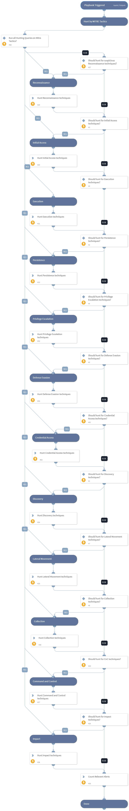

This playbook is part of the ‘Cortex XDR by Palo Alto Networks’ pack. This playbook fetch alerts related to specific entity  from Cortex XDR , on a given timeframe, based on MITRE Tactics.
Note: The playbook inputs enable manipulating the execution flow; read the input descriptions for details.

## Dependencies
This playbook uses the following sub-playbooks, integrations, and scripts.

### Sub-playbooks
This playbook does not use any sub-playbooks.

### Integrations
* CortexXDRIR

### Scripts
* CountArraySize

### Commands
* xdr-get-alerts

## Playbook Inputs
---

| **Name** | **Description** | **Default Value** | **Required** |
| --- | --- | --- | --- |
| HuntReconnaissanceTechniques | Set to True to hunt for identified alerts with MITRE Reconnaissance techniques. | True | Optional |
| HuntInitialAccessTechniques | Set to True to hunt for identified alerts with MITRE Access techniques. | True | Optional |
| HuntExecutionTechniques | Set to True to hunt for identified alerts with MITRE Execution techniques. | True | Optional |
| HuntPersistenceTechniques | Set to True to hunt for identified alerts with MITRE Persistence techniques. | True | Optional |
| HuntPrivilegeEscalationTechniques | Set to True to hunt for identified alerts with MITRE Privilege Escalation techniques. | True | Optional |
| HuntDefenseEvasionTechniques | Set to True to hunt for identified alerts with MITRE Defense Evasion techniques. | True | Optional |
| HuntDiscoveryTechniques | Set to True to hunt for identified alerts with MITRE Discovery techniques. | True | Optional |
| HuntLateralMovementTechniques | Set to True to hunt for identified alerts with MITRE Lateral Movement techniques. | True | Optional |
| HuntCollectionTechniques | Set to True to hunt for MITRE Collection techniques identified alerts. | True | Optional |
| HuntCnCTechniques | Set to True to hunt for identified alerts with MITRE Command and Control techniques. | True | Optional |
| HuntImpactTechniques | Set to True to hunt for identified alerts with MITRE Impact techniques. | True | Optional |
| entityID | Entity Value |  | Optional |
| timeRange | A time range to execute the hunting in. The input should be in the following format: \* 1 day ago \* 2 minutes ago \* 4 hours ago \* 8 days ago     | 2 hours | Optional |
| RunAll | Whether to run all the sub-tasks for Mitre Tactics. |  | Optional |
| EntityType | Entity type to search on xdr-get-alers custom filters |  | Optional |
| HuntCredentialAccessTechniques | Set to True to hunt for identified alerts with MITRE Credential Access techniques. |  | Optional |

## Playbook Outputs
---

| **Path** | **Description** | **Type** |
| --- | --- | --- |
| NextPhaseAlerts | Array size | unknown |

## Playbook Image
---
