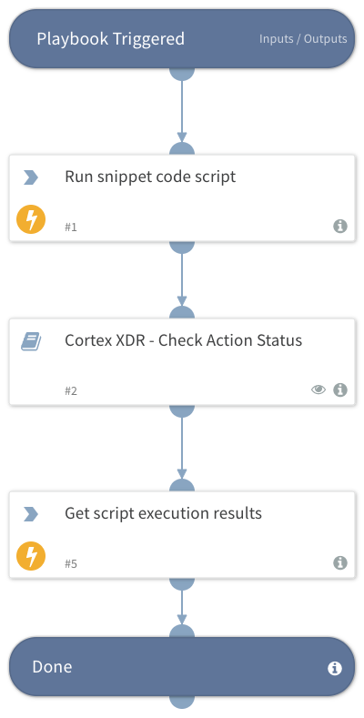

Deprecated. Use the `xdr-snippet-code-script-execute` command instead. Initiates a new endpoint script execution action using the provided snippet code and retrieves the file results.

## Dependencies

This playbook uses the following sub-playbooks, integrations, and scripts.

### Sub-playbooks

* Cortex XDR - Check Action Status

### Integrations

* CortexXDRIR

### Scripts

This playbook does not use any scripts.

### Commands

* xdr-get-script-execution-results
* xdr-run-snippet-code-script

## Playbook Inputs

---

| **Name** | **Description** | **Default Value** | **Required** |
| --- | --- | --- | --- |
| endpoint_id | A comma-separated list of endpoint IDs.  |  | Optional |
| snippet_code | Section of a script you want to initiate on an endpoint \(e.g., print\("7"\)\). |  | Optional |

## Playbook Outputs

---

| **Path** | **Description** | **Type** |
| --- | --- | --- |
| PaloAltoNetworksXDR.ScriptResult.results._return_value | Value returned by the script in case the type is not a dictionary. | unknown |

## Playbook Image

---

