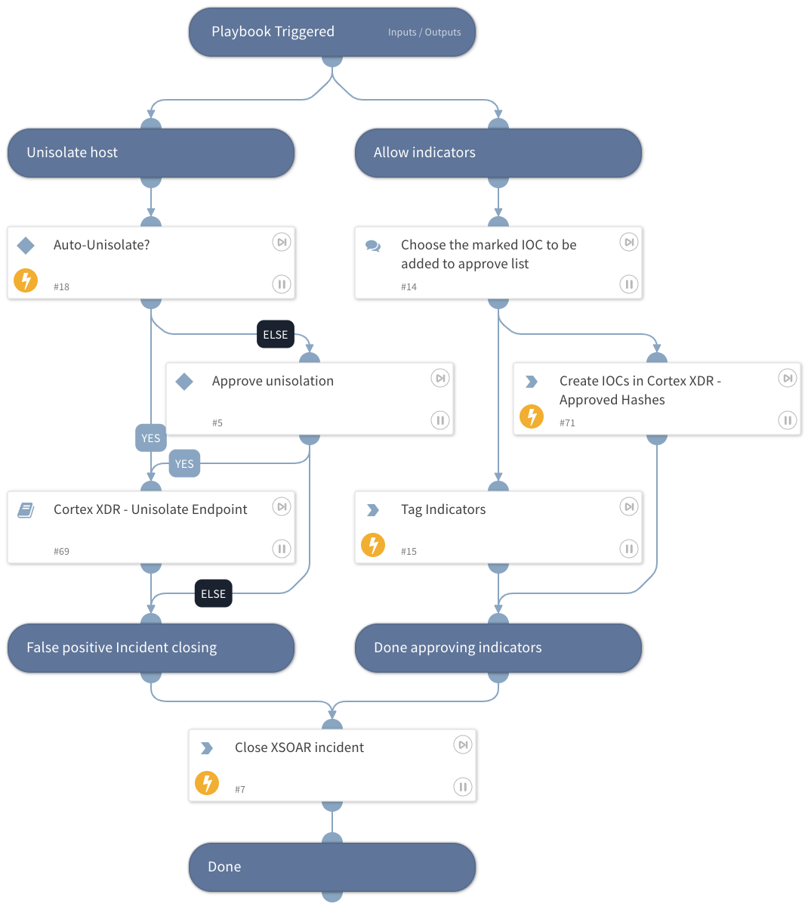

This playbook is part of the 'Malware Investigation And Response' flow. For more information, please refer to https://xsoar.pan.dev/docs/reference/packs/malware-investigation-and-response.
This Playbook handles false-positive incident closure for Cortex XDR - Malware investigation.

## Dependencies
This playbook uses the following sub-playbooks, integrations, and scripts.

### Sub-playbooks
Cortex XDR - Unisolate Endpoint

### Integrations
CortexXDRIR

### Scripts
This playbook does not use any scripts.

### Commands
* xdr-allowlist-files
* setIndicators
* closeInvestigation

## Playbook Inputs
---

| **Name** | **Description** | **Default Value** | **Required** |
| --- | --- | --- | --- |
| Comment | Add a comment to close this incident. | XSOAR Incident #${incident.id} | Optional |
| Reason | Possible values:  * Unknown  * TruePositive * FalsePositive | FalsePositive | Optional |
| AllowTag | The approving tag name for found indicators. | AllowTag | Optional |
| AutoUnisolation | Whether automatic un-isolation is allowed. | False | Optional |
| HostID | The ID of the host for running an un-isolation process. | ${incident.deviceid} | Optional |
| FileSha256 | The file SHA256 you want to block. | ${incident.filesha256} | Optional |

## Playbook Outputs
---
There are no outputs for this playbook.

## Playbook Image
---

