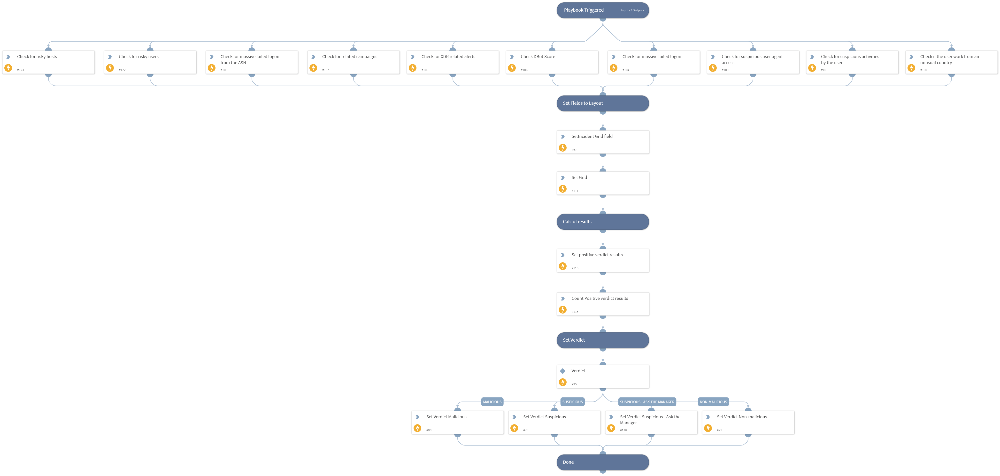

Deprecated. Use `Cortex XDR - Identity Analytics` instead.
This playbook determines the alert’s verdict based on the results of multiple checks.
By default, if at least two of the checks' results are true, the verdict is set to malicious.
else if only one check's results are true, the verdict is set to suspicious.
If none of the conditions is true, the verdict is set to non-malicious.
It is possible to change the threshold value of the inputs to change the sensitivity of the verdict.

## Dependencies

This playbook uses the following sub-playbooks, integrations, and scripts.

### Sub-playbooks

This playbook does not use any sub-playbooks.

### Integrations

This playbook does not use any integrations.

### Scripts

* SetGridField
* SetMultipleValues
* Set

### Commands

* setIncident

## Playbook Inputs

---

| **Name** | **Description** | **Default Value** | **Required** |
| --- | --- | --- | --- |
| FailedlogonUserThreshold | This is the minimum threshold for failed login attempts by the user. example: If this input is set to '30', and the playbook has found 31 failed login attempts - It will classify this check as suspicious activity. |  | Optional |
| FailedlogonFromASNThreshold | This is the minimum threshold for failed login attempts from ASN. example: If this input is set to '20', and the playbook has found 21 failed login attempts from ASN - It will classify this check as suspicious activity. |  | Optional |
| XDRRelatedAlertsThreshold | This is the minimum threshold for XDR related alerts based on user activity to identify suspicious activity. example: If this input is set to '3', and the playbook has found 4 XDR related alerts - It will classify this check as suspicious activity. |  | Optional |
| MaliciousVerdictThreshold | The 'Malicious verdict' threshold to determine a malicious verdict. Should be Greater than the "SuspiciousVerdictThreshold" input. |  | Optional |
| SuspiciousVerdictThreshold | The 'Suspicious verdict' threshold to determine a suspicious verdict. Should be lower than the "MaliciousVerdictThreshold" input. |  | Optional |
| AlertName | Alert Name. |  | Optional |
| NumOfFailedLogonASN | The number of failed logins from the ASN. |  | Optional |
| RelatedCampaign | Campaign related to the indicator. |  | Optional |
| NumOfXDRAlerts | The number of XDR alerts for the user. |  | Optional |
| NumOfFailedLogon | The number of failed logins. |  | Optional |
| NumOfOktaSuspiciousUserAgent | The number of suspicious user agents from Okta. |  | Optional |
| NumOfOktaSuspiciousActivities | The number of suspicious activities for the user from Okta. |  | Optional |
| PermanentCountry | True if the user works from a permanent country from Okta. Otherwise, false. |  | Optional |
| XDRRiskyUser | Usernames of users that were found as risky by Cortex XDR. | PaloAltoNetworksXDR.RiskyUser.id | Optional |
| XDRRiskyHost | Hostnames that were found as risky by Cortex XDR | PaloAltoNetworksXDR.RiskyHost.id  | Optional |

## Playbook Outputs

---

| **Path** | **Description** | **Type** |
| --- | --- | --- |
| Verdict | The verdict based on the results of multiple checks. | unknown |

## Playbook Image

---

