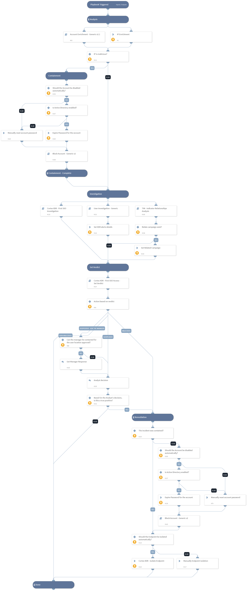

Deprecated. Use `Cortex XDR - Identity Analytics` instead.
Investigates a Cortex XDR incident containing First SSO access from ASN in organization
 or First successful SSO connection from a country in organization.

The playbook executes the following:
- IP and User Enrichment.
- User Investigation - Using 'User Investigation - Generic' sub-playbook.
- Set alert's verdict - Using 'Cortex XDR - First SSO access - Set Verdict' sub-playbook.
- Response based on the verdict.

The playbook is used as a sub-playbook in ‘Cortex XDR Incident Handling - v3’.

## Dependencies

This playbook uses the following sub-playbooks, integrations, and scripts.

### Sub-playbooks

* Cortex XDR - First SSO Access - Set Verdict
* User Investigation - Generic
* TIM - Indicator Relationships Analysis
* Block Account - Generic v2
* Account Enrichment - Generic v2.1
* Endpoint Enrichment - Generic v2.1

### Integrations

* CortexXDRIR
* XQLQueryingEngine
* XDR_iocs

### Scripts

* Set

### Commands

* okta-clear-user-sessions
* xdr-endpoint-isolate
* ip
* setIncident

## Playbook Inputs

---

| **Name** | **Description** | **Default Value** | **Required** |
| --- | --- | --- | --- |
| AutomaticallyIsolateEndpoint | Whether to isolate the endpoint automatically. | False | Optional |
| XDRRelatedAlertsThreshold |  This is the minimum threshold for XDR related alerts based on user activity to identify suspicious activity. example: If this input is set to '3', and the 'Cortex XDR - First SSO Access - Set Verdict' sub-playbook has found 4 XDR related alerts - It will classify this check as suspicious activity. The default value is '3'. | 3 | Optional |
| FailedlogonUserThreshold | This is the minimum threshold for failed login attempts by the user. example: If this input is set to '30', and the 'Cortex XDR - First SSO Access - Set Verdict' sub-playbook has found 31 failed login attempts - It will classify this check as suspicious activity. The default value is '30'. | 30 | Optional |
| FailedlogonFromASNThreshold | This is the minimum threshold for failed login attempts from ASN. example: If this input is set to '20', and the 'Cortex XDR - First SSO Access - Set Verdict' sub-playbook has found 21 failed login attempts from ASN - It will classify this check as suspicious activity. The default value is '20'. | 20 | Optional |
| EndpointID | XDR Endpoint ID. |  | Optional |
| Username | User name. |  | Optional |
| IPAddress | IP Address from the XDR Alert. |  | Optional |
| LoginCountry | The country from which the user logged in. |  | Optional |
| AutomaticallyBlockAccount | Whether to block the account automatically. | False | Optional |
| ContactUserManager | Whether to ask the user manager for the legitimacy of the login events, in case of a user logged in from an unusual country. | False | Optional |
| AlertName | Alert Name. |  | Optional |
| MaliciousVerdictThreshold | The 'Malicious verdict' threshold to determine a malicious verdict. The default value is '2'. Should be Greater than the "SuspiciousVerdictThreshold" input. | 2 | Optional |
| SuspiciousVerdictThreshold | The 'Suspicious verdict' threshold to determine a suspicious verdict. The default value is '1'. Should be lower than the "MaliciousVerdictThreshold" input. | 1 | Optional |
| SplunkIndex | Splunk's index name in which to search. Default is "\*" - All. | * | Optional |
| SplunkEarliestTime | The earliest time for the Splunk search query. | -1d | Optional |
| SplunkLatestTime | The latest time for the Splunk search query. | now | Optional |
| QRadarSearchTime | The Search Time for the QRadar search query. for example:  Last 1 days | Last 1 days | Optional |
| AzureSearchTime | The Search Time for the Azure Log Analytics search query. for example: ago\(1d\) | ago(1d) | Optional |
| SIEMFailedLogonSearch | Whether to search for failed logon logs from Siem? Can be False or True. | True | Optional |
| ThreatLogSearch | Whether to search for threat logs from PAN-OS? Can be False or True. | True | Optional |
| XDRAlertSearch | Whether to search for Related alerts from XDR? Can be False or True. | True | Optional |
| OktaSearch | Whether to search for logs from Okta? Can be False or True. | True | Optional |
| XDRUsernameField | Cortex XDR User name Field. | actor_effective_username | Optional |
| AutomaticallyClearSessions | Whether to clear all the user sessions automatically. Can be used in conjunction with the ForceClearSessionsForHighRiskUsers input. | False | Optional |
| ForceClearSessionsForHighRiskUsers | Whether to clear user sessions regardless of the AutomaticallyClearSessions input for users with High risk. Users receive their risk level based on Cortex XDR's ITDR module. The risks can be: - LOW - MED - HIGH  Setting this to True will automatically clear the user sessions in Okta if the user has a high risk. Setting this and the AutomaticallyClearSessions inputs to False, will prompt the analyst to take action manually even if the user has a high risk associated with it. | False | Optional |

## Playbook Outputs

---
There are no outputs for this playbook.

## Playbook Image

---

