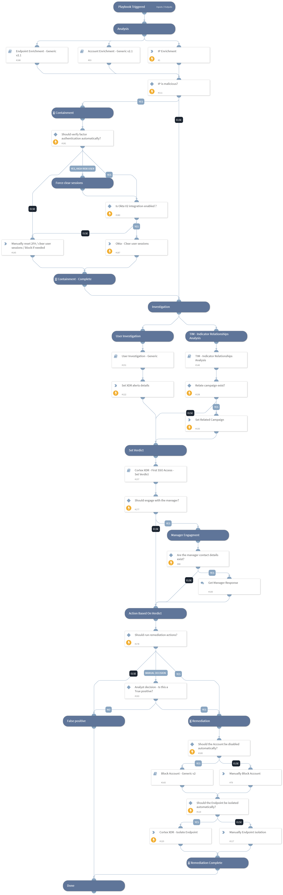

Investigates a Cortex XDR incident containing First SSO access from ASN in organization
 or First successful SSO connection from a country in organization.

The playbook executes the following:
-IP and User Enrichment.
-User Investigation - Using 'User Investigation - Generic' sub-playbook
-First SSO Access investigation - Using 'Cortex XDR - First SSO Investigation' sub-playbook
-Set alert's verdict - Using 'Cortex XDR - First SSO access - Set Verdict' sub-playbook
-Response based on the verdict

The playbook is used as a sub-playbook in ‘Cortex XDR Incident Handling - v3’

## Dependencies
This playbook uses the following sub-playbooks, integrations, and scripts.

### Sub-playbooks
* Cortex XDR - First SSO Access - Set Verdict
* Cortex XDR - First SSO Investigation
* TIM - Indicator Relationships Analysis
* User Investigation - Generic
* Block Account - Generic v2
* Account Enrichment - Generic v2.1

### Integrations
* CortexXDRIR
* XQLQueryingEngine
* XDR_iocs

### Scripts
* Set

### Commands
* setIncident
* ip
* xdr-endpoint-isolate
* ad-expire-password

## Playbook Inputs
---

| **Name** | **Description** | **Default Value** | **Required** |
| --- | --- | --- | --- |
| AutomaticallyIsolateEndpoint | Whether to isolate the endpoint automatically. | False | Optional |
| NumOfXdrAlertsThreshold | The 'XDR related alerts' threshold to determine the 'Check for XDR related alerts' check result on 'Cortex XDR - First SSO Access - Set Verdict'  sub-playbook. The default value is '3'. | 3 | Optional |
| FailedlogonUserThreshold | The 'Failed login' threshold to determine the 'Check for massive failed logon' check result on 'Cortex XDR - First SSO Access - Set Verdict' sub-playbook. The default value is '30'. | 30 | Optional |
| FailedlogonFromASNThreshold | The 'Failed login from ASN' threshold to determine the 'Check for massively failed logon from the ASN' check result on 'Cortex XDR - First SSO Access - Set Verdict' sub-playbook. The default value is '20'. | 20 | Optional |
| EndpointID | XDR Endpoint ID. |  | Optional |
| Username | User Name. |  | Optional |
| IPAddress | IP Address. |  | Optional |
| AlertID | Alert ID. |  | Optional |
| LoginCountry | The Country from which the user logged in. |  | Optional |
| AutomaticallyBlockAccount | Whether to block the account and reset the password automatically. | False | Optional |
| ContactUserManager | Whether to ask the user manager for the legitimacy of the login events, in case of a user logged in from an unusual country. | True | Optional |
| AlertName | Alert Name. |  | Optional |

## Playbook Outputs
---
There are no outputs for this playbook.

## Playbook Image
---
