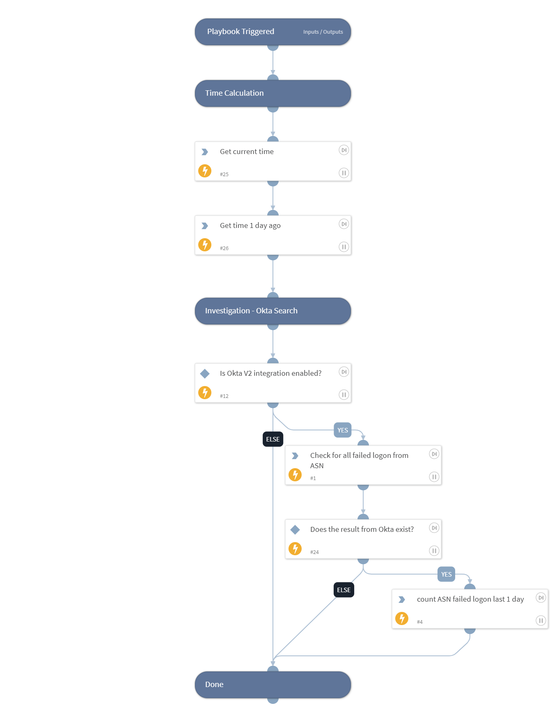

This playbook performs an investigation to Cortex XDR - First SSO Access alerts, using queries to Okta.
Supported Integration:
-Okta

## Dependencies
This playbook uses the following sub-playbooks, integrations, and scripts.

### Sub-playbooks
This playbook does not use any sub-playbooks.

### Integrations
* Okta v2

### Scripts
* CountArraySize
* GetTime

### Commands
* okta-get-logs

## Playbook Inputs
---

| **Name** | **Description** | **Default Value** | **Required** |
| --- | --- | --- | --- |
| ASN | The ASN. |  | Optional |

## Playbook Outputs
---

| **Path** | **Description** | **Type** |
| --- | --- | --- |
| NumOfFailedLogonASN | Number of failed logon from the ASN. | unknown |

## Playbook Image
---
