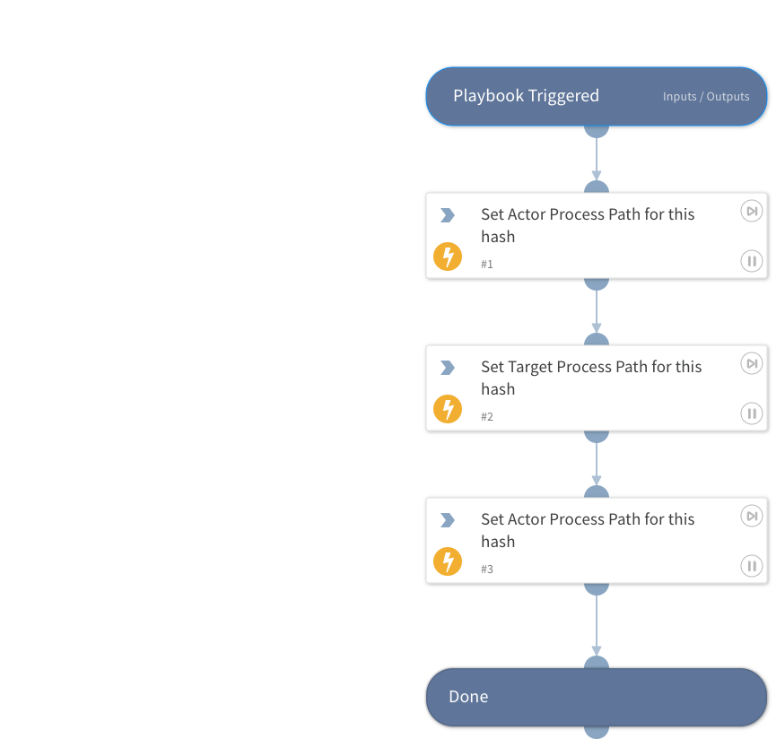

This playbook is part of the 'Malware Investigation And Response' pack. For more information, refer to https://xsoar.pan.dev/docs/reference/packs/malware-investigation-and-response.
This playbook assists in retrieving file paths from the Cortex XDR incident by hash.

## Dependencies

This playbook uses the following sub-playbooks, integrations, and scripts.

### Sub-playbooks

This playbook does not use any sub-playbooks.

### Integrations

This playbook does not use any integrations.

### Scripts

* SetAndHandleEmpty

### Commands

This playbook does not use any commands.

## Playbook Inputs

---

| **Name** | **Description** | **Default Value** | **Required** |
| --- | --- | --- | --- |
| NonFoundHashes | List of hashes to run against. | NonFoundHashes | Optional |

## Playbook Outputs

---

| **Path** | **Description** | **Type** |
| --- | --- | --- |
| fileRetrieval | The path for the requested file. | unknown |

## Playbook Image

---

