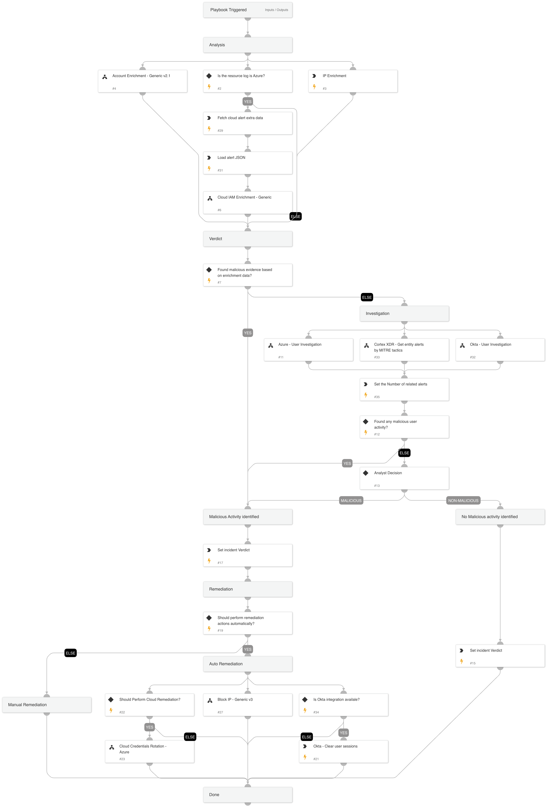

The `Cortex XDR - Identity Analytics` playbook is designed to handle Cortex XDR Identity Analytics alerts and executes the following:

Analysis:
- Enriches the IP address and the account, providing additional context and information about these indicators.

Verdict:
- Determines the appropriate verdict based on the data collected from the enrichment phase.

Investigation:
- Checks for related Cortex XDR alerts to the user by Mitre tactics to identify malicious activity.
- Checks for specific arguments for malicious usage from Okta using the 'Okta User Investigation' sub-playbook.
- Checks for specific arguments for malicious usage from Azure using the 'Azure User Investigation' sub-playbook.

Verdict Handling:
- Handles malicious alerts by initiating appropriate response actions, including blocking malicious IP addresses and revoking or clearing user's sessions.
- Handles non-malicious alerts identified during the investigation.

The playbook is used as a sub-playbook in ‘Cortex XDR Alerts Handling v2’.

## Dependencies

This playbook uses the following sub-playbooks, integrations, and scripts.

### Sub-playbooks

* Azure - User Investigation
* Cloud Credentials Rotation - Azure
* Okta - User Investigation
* Cortex XDR - Get entity alerts by MITRE tactics
* Block IP - Generic v3
* Cloud IAM Enrichment - Generic
* Account Enrichment - Generic v2.1

### Integrations

* XDR_iocs
* CortexXDRIR
* XQLQueryingEngine

### Scripts

SetAndHandleEmpty

### Commands

* okta-clear-user-sessions
* xdr-get-cloud-original-alerts
* setIncident
* ip

## Playbook Inputs

---

| **Name** | **Description** | **Default Value** | **Required** |
| --- | --- | --- | --- |
| AlertName | Alert name. |  | Optional |
| alert_id | Alert ID. |  | Optional |
| IPAddress | IP address from the XDR alert. |  | Optional |
| Username | User name. |  | Optional |
| RelatedAlertsThreshold | This is the minimum threshold for Cortex XDR related alerts, based on MITRE tactics used to identify malicious activity by the user in the last 1 day.  | 5 | Optional |
| FailedLogonThreshold | This is the minimum threshold for user login failures within the last 1 day. For example: If this input is set to '30', and the 'Okta - User Investigation' or the 'Azure - User Investigation' sub-playbooks have found 31 failed login attempts - It will classify this behavior as malicious activity. The default value is '30'. | 30 | Optional |
| OktaSuspiciousActivitiesThreshold | This is the minimum threshold for suspicious Okta activity events by the user in the last 1 day. For example: If this input is set to '5', and the 'Okta - User Investigation' sub-playbooks have found 6 events of suspicious activity by the user - It will classify this behavior as malicious activity. The default value is '5'. | 5 | Optional |
| AutoRemediation | Whether to execute the remediation flow automatically. Possible values are: "True" and "False". | False | Optional |
| IAMRemediationType | The response playbook provides the following remediation actions using MSGraph Users:  Reset: By entering "Reset" in the input, the playbook will execute password reset.  Revoke: By entering "Revoke" in the input, the playbook will revoke the user's session.  ALL: By entering "ALL" in the input, the playbook will execute the reset password and revoke session tasks. | Revoke | Optional |
| FWAutoCommit | This input determines whether to commit the configuration automatically on PAN-OS devices and other FWs.  Yes - Commit automatically. No - Commit manually. | Yes | Optional |
| UserVerification | Possible values: True/False.  Default: True. Whether to provide user verification for blocking those IPs.   False - No prompt will be displayed to the user. True - The server will ask the user for blocking verification and will display the blocking list. | False | Optional |
| InternalRange | A list of internal IP ranges to check IP addresses against. The list should be provided in CIDR notation, separated by commas. An example of a list of ranges would be: "172.16.0.0/12,10.0.0.0/8,192.168.0.0/16" \(without quotes\). If a list is not provided, will use the default list provided in the IsIPInRanges script \(the known IPv4 private address ranges\). | lists.PrivateIPs | Optional |

## Playbook Outputs

---
There are no outputs for this playbook.

## Playbook Image

---

