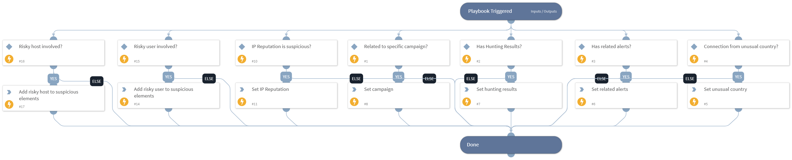

This playbook creating an array called "Suspicious Elements", which is used to count potential security threats. The following elements can be added to the array:

"IP Reputation": This element will be added if the IP reputation is deemed suspicious or malicious.
"Related Campaign": This element will be added if an RDP brute force attack from an external IP is found to be related to a specific campaign, as determined by threat intelligence management (TIM).
"Hunting Results": This element will be added if the results of "Threat Hunting - Generic" are returned.
"Related Alerts": This element will be added if any additional alerts related to the attacked user and hostname are found.
"Unusual Country": This element will be added if the RDP connection originates from an unusual country.

The array will then be outputted and its size will be compared to a final threshold. If the size is greater than or equal to the threshold, the investigation's final verdict will be deemed a "True Positive."

## Dependencies
This playbook uses the following sub-playbooks, integrations, and scripts.

### Sub-playbooks
This playbook does not use any sub-playbooks.

### Integrations
This playbook does not use any integrations.

### Scripts
* Set

### Commands
This playbook does not use any commands.

## Playbook Inputs
---

| **Name** | **Description** | **Default Value** | **Required** |
| --- | --- | --- | --- |
| RelatedAlerts | Number of XDR Alerts that related to the same user or endpoint. |  | Optional |
| RelatedCampaign | Campaign related to the external IP. |  | Optional |
| HuntResults |  determine whether hunting results exists.  the input value should be true or false. |  | Optional |
| UnusualGeoLocation |  determine whether the RDP connection has made from unusual country. the input value should be true or false. |  | Optional |
| IpReputation | The external IP reputation. |  | Optional |

## Playbook Outputs
---

| **Path** | **Description** | **Type** |
| --- | --- | --- |
| Suspicious_Elements | Array that contains all the suspicious elements. | unknown |

## Playbook Image
---
