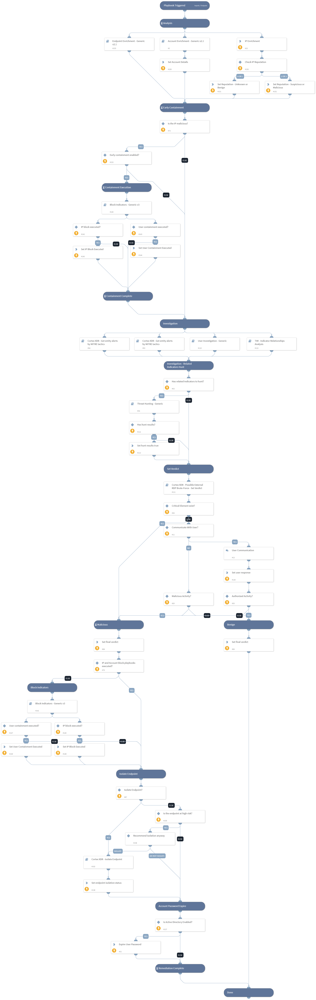

This playbook investigates a “Possible External RDP Brute Force” XDR Alert by gathering user, IP and hostname information, and investigating if the following suspicious elements exists:
- "IP Reputation" - Dbot Score is 2-3 
- "Source geolocation" - Connection from unusual country 
-  Related to campaign - IP address related to campaign, based on TIM module
-  Hunting results - hunt for indicators related to the source IP and the related campaign returned results
-  XDR Alert search -XDR Alerts related to the same username and endpoint, and to the MITRE tactics that comes after "Credential Access"

Set verdict method:
* Critical Element - The "Critical Element" input allows you to select a specific element that, if identified as suspicious,  the investigation's final verdict will be deemed a "True Positive".

* Final Verdict -  Each suspicious element is being added to an array called "Suspicious Elements", which is used to count potential security threats. The array size will be compared to a final threshold. If the size is greater than or equal to the threshold, the investigation's final verdict will be deemed a "True Positive".

* User Engagement - The "UserEngagementThreshold" input allows you to set the number of suspicious elements that trigger user engagement. When this threshold is met, an email will be sent to the user and their manager asking for authorization of RDP activity. If the RDP activity is not authorized by the user, the investigation's final verdict will be deemed a "True Positive".

## Dependencies
This playbook uses the following sub-playbooks, integrations, and scripts.

### Sub-playbooks
* User Investigation - Generic
* Threat Hunting - Generic
* TIM - Indicator Relationships Analysis
* Block IP - Generic v3
* Account Enrichment - Generic v2.1
* Cortex XDR - Get entity alerts by MITRE tactics
* Cortex XDR - Isolate Endpoint
* Cortex XDR - Possible External RDP Brute-Force - Set Verdict
* Block Account - Generic v2

### Integrations
* CortexXDRIR
* XDR_iocs
* XQLQueryingEngine

### Scripts
* Set

### Commands
* ip
* ad-expire-password
* setIncident

## Playbook Inputs
---

| **Name** | **Description** | **Default Value** | **Required** |
| --- | --- | --- | --- |
| Username | RDP connection username. | momi | Optional |
| ExternalIP | Source external IP address. | 85.86.242.245 | Optional |
| AutoRemediation | Set value "true" to enable auto remediation\(IP Block and User Block\). | false | Optional |
| FinalThreshold | The threshold number of suspicious elements required to determine a 'True Positive' verdict. | 3 | Optional |
| CriticalElement | You can select a specific element that, if identified as suspicious, will automatically set the final verdict as true positive. The following options are available: IP Reputation Related Campaign Hunting Results Related Alerts Unusual Country  NOTE: you can read about the meaning of every element in the playbook description. |  | Optional |
| UserEngagementThreshold | the threshold number of suspicious elements that will trigger a user engagement. set "false" to disable user engagement.  NOTICE: if this threshold will be equal or higher than "FinalThreshold", the final verdict will be deemed by the user response and not by the FinalThreshold calculation. | 2 | Optional |
| Hostname | RDP connection destination hostname. |  | Optional |
| EndpointID | RDP connection destination endpoint ID. |  | Optional |
| Alert_Name | Alert name. |  | Optional |
| AlertDescription | Alert description |  | Optional |
| Country | Source external IP country. |  | Optional |
| IsolateEndpoint | set value "true" to enable endpoint isolation in case of a true positive. | false | Optional |

## Playbook Outputs
---
There are no outputs for this playbook.

## Playbook Image
---
