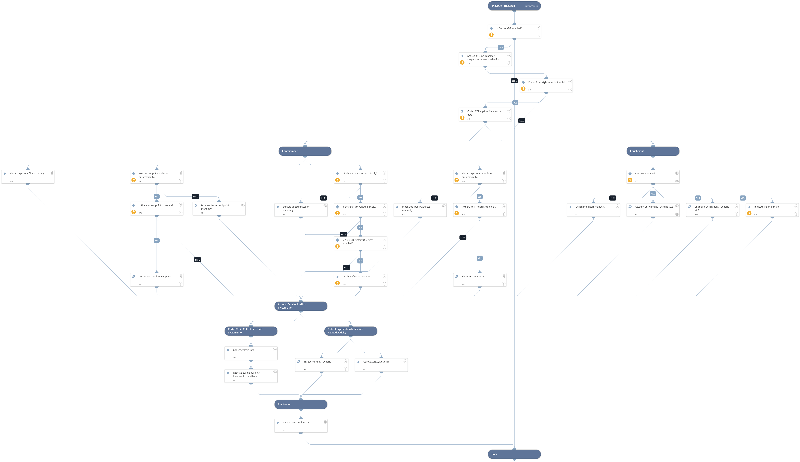

The playbook targets specific PrintNightmare rules written by Cortex XDR for both vulnerabilities:
[CVE-2021-1675 LPE](https://nvd.nist.gov/vuln/detail/CVE-2021-1675)
[CVE-2021-34527 RCE](https://nvd.nist.gov/vuln/detail/CVE-2021-34527)

This playbook includes the following tasks:
- Containment of files, endpoints, users and IP Addresses
- Enrichment of indicators
- Data acquisition of system info and files using Cortex XDR
- Eradicating compromised user credentials

** Note: This is a beta playbook, which lets you implement and test pre-release software. Since the playbook is beta, it might contain bugs. Updates to the pack during the beta phase might include non-backward compatible features. We appreciate your feedback on the quality and usability of the pack to help us identify issues, fix them, and continually improve.

## Dependencies

This playbook uses the following sub-playbooks, integrations, and scripts.

### Sub-playbooks

* Account Enrichment - Generic v2.1
* Endpoint Enrichment - Generic v2.1
* Cortex XDR - Isolate Endpoint
* Block IP - Generic v3
* Threat Hunting - Generic

### Integrations

* CortexXDRIR

### Scripts

* SearchIncidentsV2

### Commands

* ad-disable-account
* enrichIndicators
* xdr-get-incident-extra-data

## Playbook Inputs

---

| **Name** | **Description** | **Default Value** | **Required** |
| --- | --- | --- | --- |
| IsolateEndpointAutomatically | Whether to isolate the endpoint automatically  | False | Optional |
| DisableAccountAutomatically | Whether to disable the account automatically  | True | Optional |
| BlockIPAutomatically | Whether to block the IP Address automatically  | True | Optional |
| EnrichAutomatically | Whether to run indicators auto enrichment automatically  | True | Optional |
| UserVerification | Possible values: True/False. Whether to provide user verification for blocking IPs.   False - No prompt will be displayed to the user. True - The server will ask the user for blocking verification and will display the blocking list. | False | Optional |

## Playbook Outputs

---
There are no outputs for this playbook.

## Playbook Image

---

