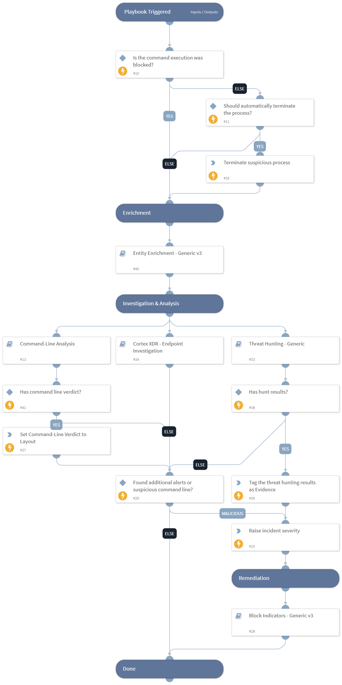

The "Remote PsExec-like LOLBIN Command Execution" playbook is designed to address and respond to alerts indicating suspicious activities related to remote PsExec-like LOLBIN command execution from an unsigned non-standard source. 
The playbook aims to efficiently:

- Get the alert data and check if the execution is blocked. If not will terminate the process (manually by default).
- Enrich any entities and indicators from the alert and find any related campaigns.
- Perform command analysis to provide insights and a verdict for the executed command.
- Perform further endpoint investigation using Cortex XDR.
- Checks for any malicious verdicts found to raise the severity of the alert.
- Perform automatic/manual remediation response by blocking any malicious indicators found.

The playbook is designed to run as a sub-playbook in "Cortex XDR Incident Handling - v3 & Cortex XDR Alerts Handling".
It depends on the data from the parent playbooks and cannot be used as a standalone version.

## Dependencies

This playbook uses the following sub-playbooks, integrations, and scripts.

### Sub-playbooks

* Command-Line Analysis
* Threat Hunting - Generic
* Block Indicators - Generic v3
* Cortex XDR - Endpoint Investigation
* Entity Enrichment - Generic v3

### Integrations

* CortexXDRIR

### Scripts

* IncreaseIncidentSeverity
* AddEvidence

### Commands

* setIncident
* xdr-script-commands-execute

## Playbook Inputs

---

| **Name** | **Description** | **Default Value** | **Required** |
| --- | --- | --- | --- |
| SrcIPAddress | The remote IP address that executed the process. | incident.xdralerts.actionremoteip | Optional |
| alerts_ids | The IDs of the relevant alerts. | incident.xdralerts.alert_id | Optional |
| AutoRemediation | Whether remediation will be run automatically or manually. If set to "True" - remediation will be automatic. | false | Optional |
| EndpointIDs | The IDs of the victim endpoint. | incident.xdralerts.endpoint_id | Optional |
| HighAlertsThreshold | The threshold number of additional high severity alerts. | 1 | Optional |
| CriticalAlertsThreshold | The threshold number of additional critical severity alerts. | 1 | Optional |

## Playbook Outputs

---
There are no outputs for this playbook.

## Playbook Image

---

