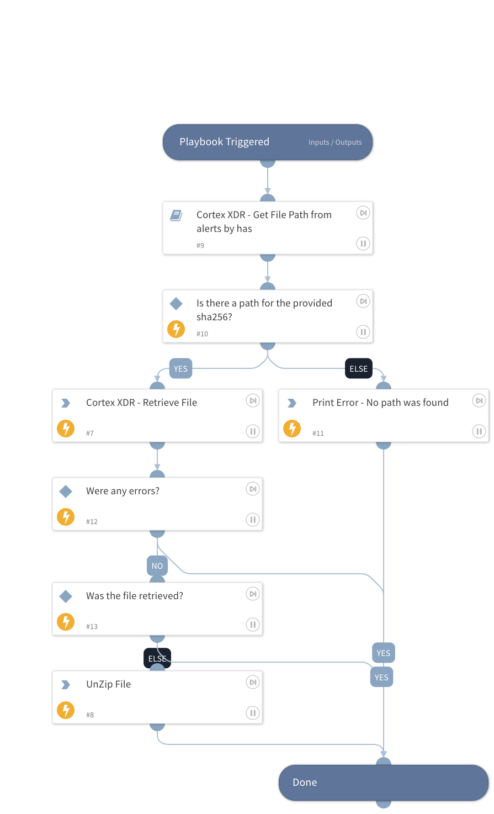

This playbook is part of the 'Malware Investigation And Response' pack. For more information, refer to https://xsoar.pan.dev/docs/reference/packs/malware-investigation-and-response.
The playbook facilitates the process of retrieving files from the investigated devices, unzipping the retrieved files, and loading them into the War Room.

This playbook consists of the following steps:

Initially, the sub-playbook 'Cortex XDR - Get File Path from alerts by hash' examines the SHA256 file hashes and retrieves the file paths associated with each hash.
As soon as the SHA256 hashes, file paths, and endpoint IDs are obtained, the playbook attempts to retrieve the files from all the investigated devices.
Once the file retrieval automation has been completed successfully, the playbook will unzip the files and load them into the War Room.

  Note: When retrieving multiple files, ensure that the SHA256 input is set to run in a loop.

## Dependencies

This playbook uses the following sub-playbooks, integrations, and scripts.

### Sub-playbooks

* Cortex XDR - Get File Path from alerts by hash

### Integrations

* CortexXDRIR

### Scripts

* PrintErrorEntry
* UnzipFile
* isError

### Commands

* xdr-file-retrieve

## Playbook Inputs

---

| **Name** | **Description** | **Default Value** | **Required** |
| --- | --- | --- | --- |
| Sha256 | SHA256 for the file to be retrieved. |  | Optional |

## Playbook Outputs

---

| **Path** | **Description** | **Type** |
| --- | --- | --- |
| File | Retrieve the file details command results. | unknown |
| File.Name | The full file name \(including the file extension\). | String |
| File.EntryID | The ID for locating the file in the War Room. | String |
| File.Size | The size of the file in bytes. | Number |
| File.MD5 | The MD5 hash of the file. | String |
| File.SHA1 | The SHA1 hash of the file. | String |
| File.SHA256 | The SHA256 hash of the file. | String |
| File.SHA512 | The SHA512 hash of the file. | String |
| File.Extension | The file extension. For example, 'xls'. | String |
| File.Type | The file type, as determined by libmagic \(same as displayed in the file entries\). | String |

## Playbook Image

---

