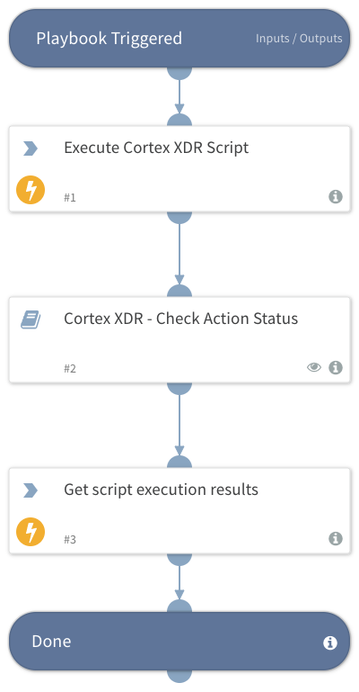

Deprecated. Use the `xdr-script-run` command instead. Initiates a new endpoint script execution action using a provided script unique ID from Cortex XDR script library.
## Dependencies
This playbook uses the following sub-playbooks, integrations, and scripts.

### Sub-playbooks
* Cortex XDR - Check Action Status

### Integrations
* CortexXDRIR

### Scripts
This playbook does not use any scripts.

### Commands
* xdr-run-script
* xdr-get-script-execution-results

## Playbook Inputs
---

| **Name** | **Description** | **Default Value** | **Required** |
| --- | --- | --- | --- |
| endpoint_ids | A comma-separated list of endpoint IDs.  |  | Optional |
| script_uid | Unique identifier of the script. Can be retrieved by running the xdr-get-scripts command. |  | Optional |
| parameters | Dictionary contains the parameter name as key and its value for this execution as the value. For example, \{"param1":"param1_value","param2":"param2_value"\}. The required parameters for each script can be retrieved by running xdr-get-script-metadata with the script uid. |  | Optional |
| script_timeout | The timeout in seconds for this execution. \(Default is: '600'\) |  | Optional |
| polling_timeout | Amount of time to poll action status before declaring a timeout and resuming the playbook \(in minutes\). | 10 | Optional |

## Playbook Outputs
---

| **Path** | **Description** | **Type** |
| --- | --- | --- |
| PaloAltoNetworksXDR.ScriptResult.results._return_value | Value returned by the script in case the type is not a dictionary. | unknown |

## Playbook Image
---
