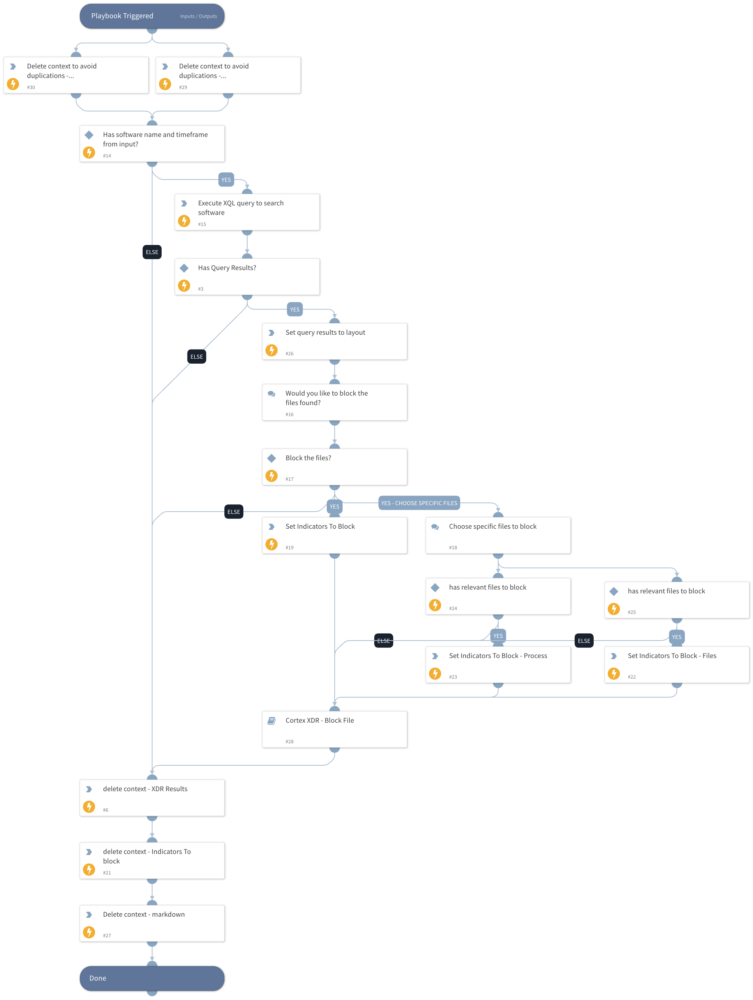

This playbook will search a  file or process activity of a software by a given image file name using Cortex XDR XQL Engine. The analyst can than choose the files he wishes to block.

## Dependencies

This playbook uses the following sub-playbooks, integrations, and scripts.

### Sub-playbooks

* Cortex XDR - Block File

### Integrations

* XQLQueryingEngine

### Scripts

* JsonToTable
* Set
* DeleteContext

### Commands

* xdr-xql-generic-query

## Playbook Inputs

---

| **Name** | **Description** | **Default Value** | **Required** |
| --- | --- | --- | --- |
| Filename |  |  | Optional |
| TimeFrame |  |  | Optional |

## Playbook Outputs

---
There are no outputs for this playbook.

## Playbook Image

---

