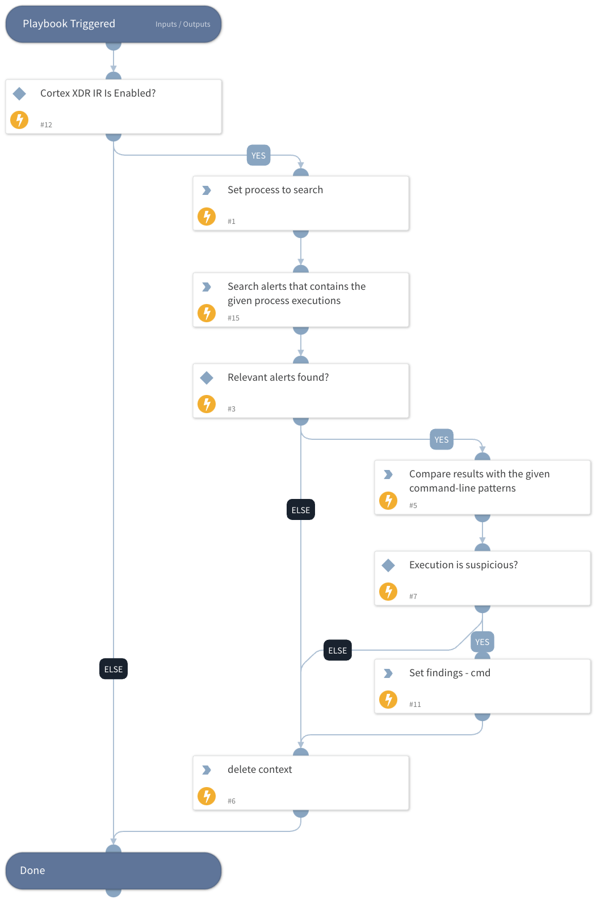

This playbook is a generic playbook that receives a process name and command-line argument. It uses the "Cortex XDR IR" integration to search for the given process executions inside Cortex XDR alerts and compares the command-line argument from the results to the command-line argument received from the playbook input.

Note: Under the "Processes" input, the playbook should receive an array that contains the following keys:
- value: *process name*
- commands: *command-line arguments*.

## Dependencies

This playbook uses the following sub-playbooks, integrations, and scripts.

### Sub-playbooks

This playbook does not use any sub-playbooks.

### Integrations

* CortexXDRIR

### Scripts

* StringSimilarity
* Set
* DeleteContext

### Commands

* xdr-get-alerts

## Playbook Inputs

---

| **Name** | **Description** | **Default Value** | **Required** |
| --- | --- | --- | --- |
| Processes | Process name to search and command-line argument to compare. This input should receive an array that contains the following keys: - value: \*process name\* - commands: \*command-line arguments\* |  | Optional |
| HuntingTimeFrame | Time in relative date or range format \(for example: "1 day", "3 weeks ago", "between 2021-01-01 12:34:56 \+02:00 and 2021-02-01 12:34:56 \+02:00"\). The default is the last 24 hours. | 7 Days | Optional |
| StringSimilarityThreshold | StringSimilarity automation threshold. A number between 0 and 1, where 1 represents the most similar results of string comparisons. The automation will output only the results with a similarity score equal to or greater than the specified threshold. | 0.5 | Optional |
| SearchXDRAlerts | Set to "True" if you want to hunt for processes that are part of XDR alerts |  | Optional |

## Playbook Outputs

---

| **Path** | **Description** | **Type** |
| --- | --- | --- |
| StringSimilarity | StringSimilarity automation results. | unknown |
| Findings | Suspicious process executions found. | unknown |

## Playbook Image

---

