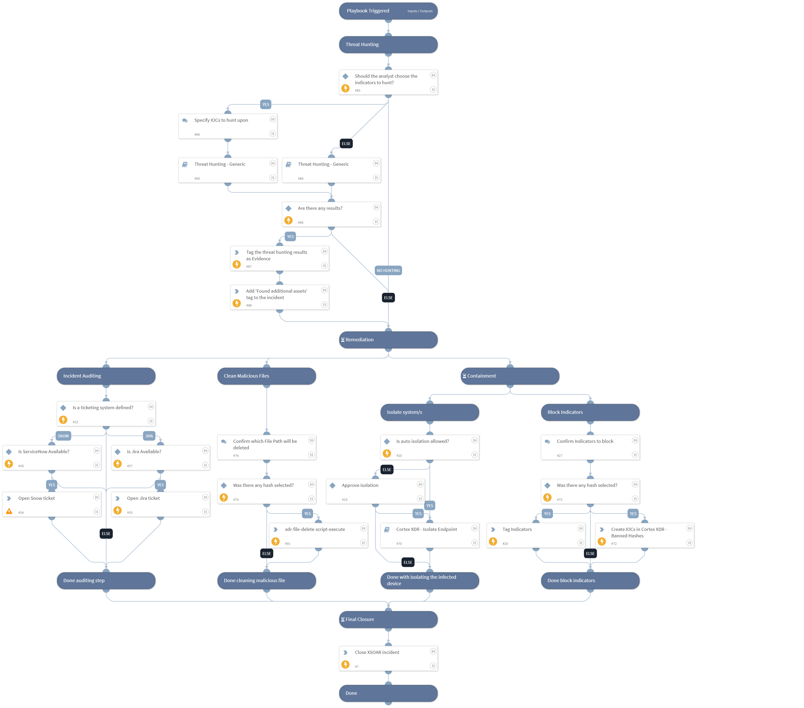

This playbook is part of the 'Malware Investigation And Response' pack. For more information, refer to https://xsoar.pan.dev/docs/reference/packs/malware-investigation-and-response.
This playbook handles a true-positive incident closure for Cortex XDR - Malware Investigation.

## Dependencies

This playbook uses the following sub-playbooks, integrations, and scripts.

### Sub-playbooks

* Threat Hunting - Generic
* Cortex XDR - Isolate Endpoint

### Integrations

* CortexXDRIR
* Cortex XDR - IR

### Scripts

* AddEvidence
* ServiceNowCreateIncident
* IsIntegrationAvailable

### Commands

* setIncident
* jira-create-issue
* xdr-blocklist-files
* closeInvestigation
* setIndicators
* xdr-file-delete-script-execute

## Playbook Inputs

---

| **Name** | **Description** | **Default Value** | **Required** |
| --- | --- | --- | --- |
| Comment | Add comment to close this incident. | XSOAR Incident #${incident.id} | Optional |
| Classification | Choose From - "Unknown" / "TruePositive" | TruePositive | Optional |
| BlockTag | Specify the banning tag name for founded indicators. | BlockTag | Optional |
| AutoIsolation | Indicates if automatic host isolation is allowed. True/False | False | Optional |
| TicketProjectName | For ticketing systems such as Jira a project name is required. |  | Optional |
| TicketingSystemToUse | The name of the ticketing system to use, for example Jira or ServiceNow |  | Optional |
| FileSha256 | Enter the File SHA256 you would like to block. Also, this input can be used in the Threat Hunting step. | incident.filesha256 | Optional |
| HostID | The ID of the host for running an isolation process. | incident.deviceid | Optional |
| FilePaths | Enter the File paths you would like to delete. | incident.processpaths | Optional |
| ManuallyChooseIOCForHunting | This input will provide you the ability to select IOCs to be hunted using the Threat Hunting - generic playbook. If false, it will hunt for all IOCs detected in the incident. Note: You can also insert "No Threat Hunting" to skip the Threat Hunting stage. | True | Optional |
| IP | IP value to hunt for. | IP | Optional |
| MD5 | MD5 file value to hunt for. | File.MD5 | Optional |
| URL_or_Domain | URL or domain to hunt for. | Domain | Optional |
| FileSha1 | File SHA1 value to hunt on. | File.SHA1 | Optional |

## Playbook Outputs

---
There are no outputs for this playbook.

## Playbook Image

---

