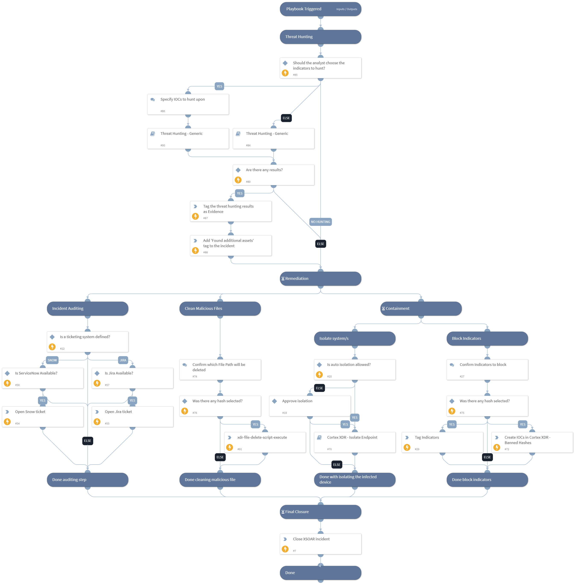

This Playbook handles a true-positive incident closure for Cortex XDR - Malware Investigation.

## Dependencies
This playbook uses the following sub-playbooks, integrations, and scripts.

### Sub-playbooks
* Cortex XDR - delete file
* Cortex XDR - Isolate Endpoint

### Integrations
* CortexXDRIR

### Scripts
* ServiceNowCreateIncident
* IsIntegrationAvailable

### Commands
* setIndicators
* closeInvestigation
* jira-create-issue
* xdr-blocklist-files

## Playbook Inputs
---

| **Name** | **Description** | **Default Value** | **Required** |
| --- | --- | --- | --- |
| Comment | Add comment to close an incident on the Microsoft Defender For Endpoint side | XSOAR Incident #${incident.id} | Optional |
| Classification | Choose From - "Unknown" / "TruePositive" / "FalsePositive" | Unknown | Optional |
| BlockTag | Specify the banning tag name for founded indicators. | BlockTag | Optional |
| AutoIsolation | Indicates if automatic host isolation is allowed. True/False | False | Optional |
| TicketProjectName | For ticketing systems such as Jira a project name is required. |  | Optional |
| TicketingSystemToUse | The name of the ticketing system to use, for example Jira or ServiceNow |  | Optional |
| FileSha256 | Enter the File Sha256 you would like to block. | ${incident.filesha256} | Optional |
| HostID | The ID of the host for running an isolation process. | ${incident.deviceid} | Optional |
| FilePaths | Enter the File paths you would like to delete. | ${incident.processpath} | Optional |

## Playbook Outputs
---
There are no outputs for this playbook.

## Playbook Image
---
