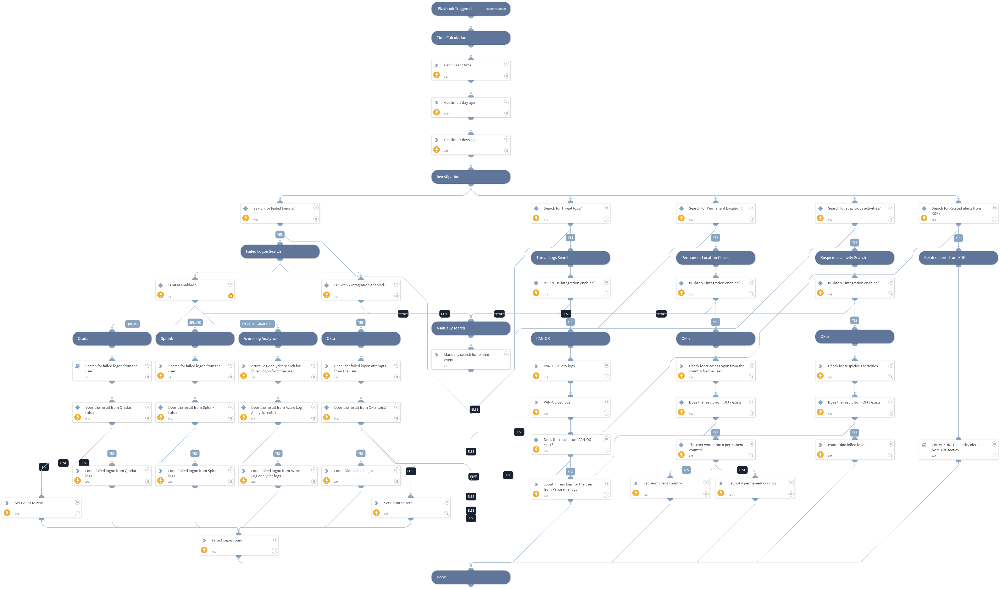

This playbook is part of the Cortex XDR by Palo Alto Networks’ pack. This playbook search data and logs related to a specific user from Siem, Identities management systems, and Firewalls.

## Dependencies
This playbook uses the following sub-playbooks, integrations, and scripts.

### Sub-playbooks
* QRadarFullSearch
* Cortex XDR - Get entity alerts by MITRE tactics

### Integrations
* Okta v2

### Scripts
* MathUtil
* Set
* GetTime
* CountArraySize

### Commands
* splunk-search
* okta-get-logs
* pan-os-get-logs
* pan-os-query-logs
* azure-log-analytics-execute-query

## Playbook Inputs
---

| **Name** | **Description** | **Default Value** | **Required** |
| --- | --- | --- | --- |
| SplunkIndex | Splunk's index name in which to search. Default is "\*" - All. | * | Optional |
| SplunkEarliestTime | The earliest time for the Splunk search query. | -1d | Optional |
| SplunkLatestTime | The latest time for the Splunk search query. | now | Optional |
| UserEmail | User Email. |  | Optional |
| Username | Username. |  | Optional |
| LoginCountry | The Country from which the user logged in. |  | Optional |
| CurrentTime | Date/Time Format profile of ISO 8601. For example: 2022-05-13T16:22:18Z. | TimeNow.[0] | Optional |
| TimeLast1Day | Date/Time Format profile of ISO 8601. For example: 2022-05-13T16:22:18Z. | TimeNow.[1] | Optional |
| TimeLast7Days | Date/Time Format profile of ISO 8601. For example: 2022-05-13T16:22:18Z. | TimeNow.[2] | Optional |
| FailedLogonSearch | Whether to search for failed logon logs from Siem? Can be False or True. | True | Optional |
| ThreatLogSearch | Whether to search for threat logs from PAN-OS? Can be False or True. | True | Optional |
| LocationSearch | Whether to search for the user's permanent location? Can be False or True. | True | Optional |
| XdrAlertSearch | Whether to search for Related alerts from XDR? Can be False or True. | True | Optional |
| OktaSuspiciousactivitySearch | Whether to search for Suspicious activities from Okta? Can be False or True. | True | Optional |

## Playbook Outputs
---

| **Path** | **Description** | **Type** |
| --- | --- | --- |
| PermanentCountry | True if the user work from a permanent country. False if else. | unknown |
| NumOfFailedLogon | Number of failed login from Siem. | unknown |
| NumOfThreatLogs | Number of Threat Logs for the user from Panorama. | unknown |
| PaloAltoNetworksXDR.Alert | XDR Alerts. | unknown |
| ArraySize | Number of xdr alert for the user. | unknown |
| NumOfOktaSuspiciousActivities | Number of Suspicious Activities for the user from Okta. | unknown |
| OktaSuspiciousActivities | Suspicious activities logs from Okta. | unknown |

## Playbook Image
---
