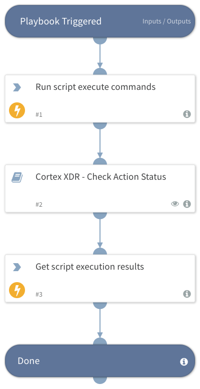

Deprecated. Use the `xdr-script-commands-execute` command instead. Initiates a new script execution of shell commands.

## Dependencies

This playbook uses the following sub-playbooks, integrations, and scripts.

### Sub-playbooks

* Cortex XDR - Check Action Status

### Integrations

* CortexXDRIR

### Scripts

This playbook does not use any scripts.

### Commands

* xdr-run-script-execute-commands
* xdr-get-script-execution-results

## Playbook Inputs

---

| **Name** | **Description** | **Default Value** | **Required** |
| --- | --- | --- | --- |
| endpoint_ids | A comma-separated list of endpoint IDs. |  | Optional |
| commands | A comma-separated list of shell commands to execute. |  | Optional |
| script_timeout | The timeout in seconds for this execution. \(Default is: '600'\) |  | Optional |
| polling_timeout | Amount of time to poll action status before declaring a timeout and resuming the playbook \(in minutes\). | 10 | Optional |

## Playbook Outputs

---
There are no outputs for this playbook.

## Playbook Image

---

