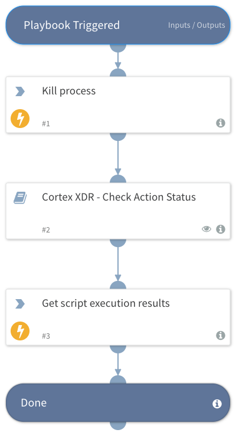

Deprecated. Use the `xdr-kill-process-script-execute` command instead. Initiates a new endpoint script execution kill process and retrieves the results.

## Dependencies

This playbook uses the following sub-playbooks, integrations, and scripts.

### Sub-playbooks

* Cortex XDR - Check Action Status

### Integrations

* CortexXDRIR

### Scripts

This playbook does not use any scripts.

### Commands

* xdr-run-script-kill-process
* xdr-get-script-execution-results

## Playbook Inputs

---

| **Name** | **Description** | **Default Value** | **Required** |
| --- | --- | --- | --- |
| endpoint_id | A comma-separated list of endpoint IDs.  |  | Optional |
| process_name |  A comma-separated list of process names to kill. Process will be killed on all provided endpoint ids. |  | Optional |
| script_timeout | The timeout in seconds for this execution. \(Default is: '600'\) |  | Optional |
| polling_timeout | Amount of time to poll action status before declaring a timeout and resuming the playbook \(in minutes\). | 10 | Optional |

## Playbook Outputs

---

| **Path** | **Description** | **Type** |
| --- | --- | --- |
| PaloAltoNetworksXDR.ScriptResult.results._return_value | Value returned by the script in case the type is not a dictionary. | unknown |
| PaloAltoNetworksXDR.ScriptResult.results.standard_output | The STDOUT and the STDERR logged by the script during the execution. | unknown |

## Playbook Image

---

