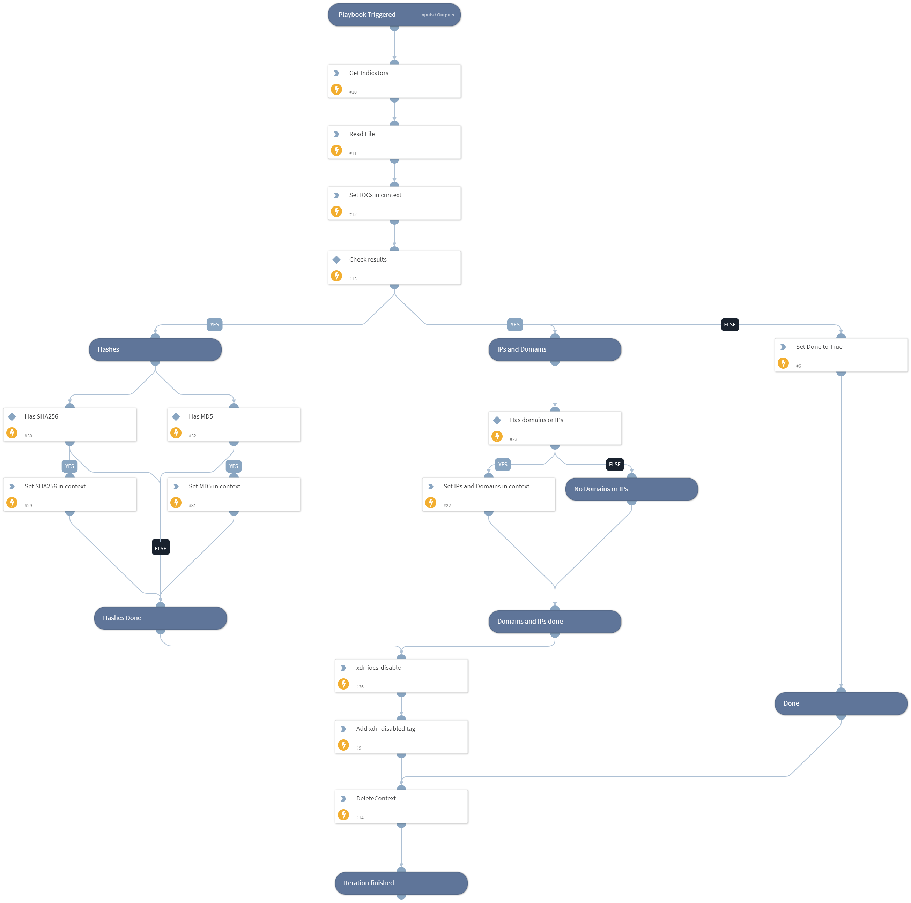

This playbook will disables indicators in XDR after they have expired from XSOAR.

## Dependencies

This playbook uses the following sub-playbooks, integrations, and scripts.

### Sub-playbooks

This playbook does not use any sub-playbooks.

### Integrations

* Cortex XDR - IOC

### Scripts

* Set
* ReadFile
* DeleteContext
* GetIndicatorsByQuery

### Commands

* xdr-iocs-disable
* appendIndicatorField

## Playbook Inputs

---

| **Name** | **Description** | **Default Value** | **Required** |
| --- | --- | --- | --- |
| batch_size |  |  | Optional |
| query |  |  | Required |

## Playbook Outputs

---
There are no outputs for this playbook.

## Playbook Image

---

