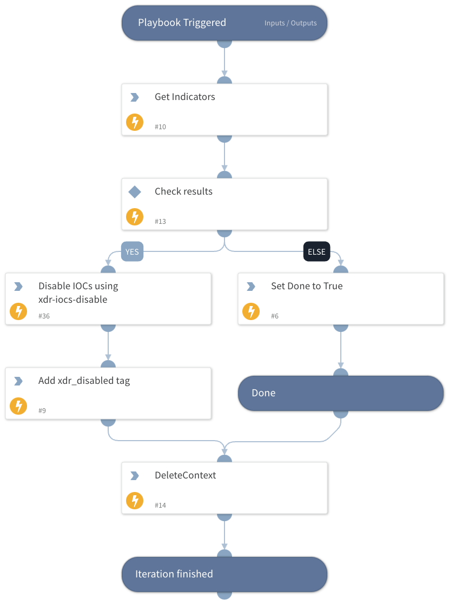

This is a *sub-playbook* of "Cortex XDR IOCs - Push new IOCs to XDR (Main)". This playbook will will disable indicators in XDR after they have expired from XSOAR using a loop and querying on the "xdr_pushed" tag.

## Dependencies

This playbook uses the following sub-playbooks, integrations, and scripts.

### Sub-playbooks

This playbook does not use any sub-playbooks.

### Integrations

* Cortex XDR - IOC

### Scripts

* Set
* GetIndicatorsByQuery
* DeleteContext
* ReadFile

### Commands

* appendIndicatorField
* xdr-iocs-disable

## Playbook Inputs

---

| **Name** | **Description** | **Default Value** | **Required** |
| --- | --- | --- | --- |
| batch_size |  |  | Optional |
| query |  |  | Required |

## Playbook Outputs

---
There are no outputs for this playbook.

## Playbook Image

---

