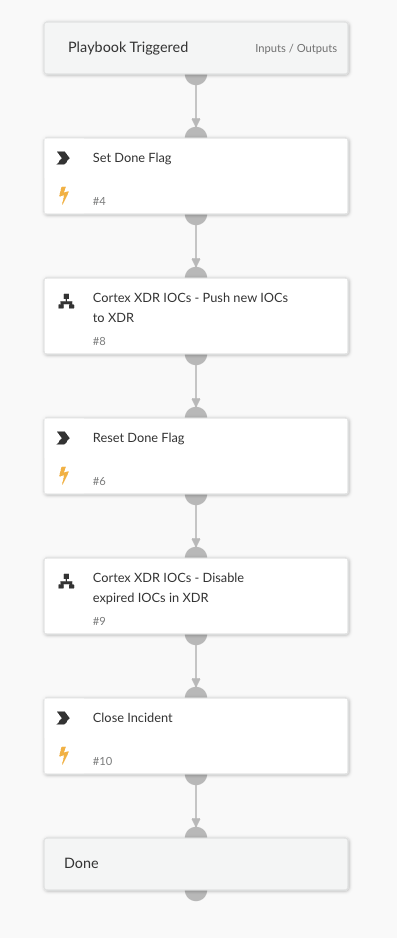

This is the *main* playbook for XDR IOCs sync. The playbook will "sync" IOCs into XDR by pushing new IOCs in and disabling expired IOCs. The playbook utilizes XSOAR tags and loops in order to find IOCs using a query provided by the user. The play book will iterate over the IOCs pushing them in batches into XDR. In the second phase the playbook will disable expired  IOCs that were previously pushed into XDR. We recommend running this playbook as a Job a few times a day after disabling the integration sync function.

## Dependencies

This playbook uses the following sub-playbooks, integrations, and scripts.

### Sub-playbooks

* Cortex XDR IOCs - Disable expired IOCs in XDR
* Cortex XDR IOCs - Push new IOCs to XDR

### Integrations

This playbook does not use any integrations.

### Scripts

* Set

### Commands

This playbook does not use any commands.

## Playbook Inputs

---

| **Name** | **Description** | **Default Value** | **Required** |
| --- | --- | --- | --- |
| batch_size | This parameter will set the batch size to be pushed into XDR with every iteration of the loop. | 4000 | Optional |
| query | The query used to search for IOCs from XSOAR to be pushed into XDR. This query must include \`-tags:xdr_pushed and -tags:xdr_not_processed\` in order to work properly. | reputation:Bad and (type:File or type:Domain or type:IP) and expirationStatus:active and -tags:xdr_pushed and -tags:xdr_not_processed | Required |

## Playbook Outputs

---
There are no outputs for this playbook.

## Playbook Image

---

