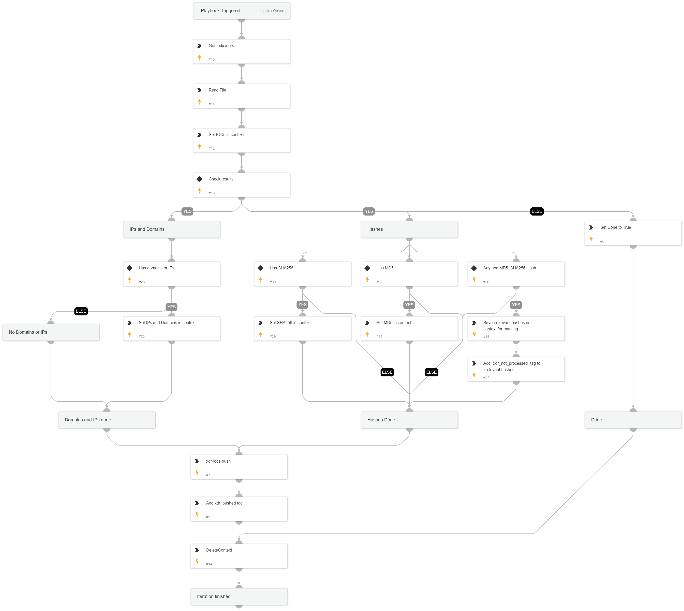

This is a *sub-playbook* of "Cortex XDR IOCs - Push new IOCs to XDR - Main" and should not be run on its own. This sub-playbook will retrieve IOCs according to the users query input (passed from the main playbook) and push them into Cortex XDR, and mark them as "xdr_pushed" or "xdr_not_processed" for further processing.

## Dependencies

This playbook uses the following sub-playbooks, integrations, and scripts.

### Sub-playbooks

This playbook does not use any sub-playbooks.

### Integrations

XDR_iocs

### Scripts

* ReadFile
* DeleteContext
* GetIndicatorsByQuery
* Set

### Commands

* appendIndicatorField
* xdr-iocs-push

## Playbook Inputs

---

| **Name** | **Description** | **Default Value** | **Required** |
| --- | --- | --- | --- |
| batch_size | This parameter will set the batch size to be pushed into Cortex XDR with every iteration of the loop. | 4000 | Optional |
| query | The query used to search for IOCs from Cortex XSOAR to be pushed into Cortex XDR. This query must include \`-tags:xdr_pushed and -tags:xdr_not_processed\` in order to work properly. | reputation:Bad and (type:File or type:Domain or type:IP) and expirationStatus:active and -tags:xdr_pushed and -tags:xdr_not_processed | Required |

## Playbook Outputs

---
There are no outputs for this playbook.

## Playbook Image

---

